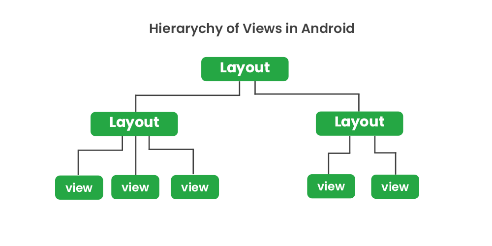

<div align="center">

[**_``Go Back``_**](../README.md)

# Mechi Multiple Campus (Internal Exam)

</div>

## Short Question
------------------

### (1) What do you mean by Mobile Programming? Explain Life Cycle of mobile application development.

``Mobile programming`` refers to the process of creating software applications that run on mobile devices such as smartphones and tablets. These applications, commonly known as mobile apps, are designed to provide various functionalities, services, and experiences to users on the go.

The life cycle of mobile application development refers to the stages that a mobile app goes through from its inception to its eventual retirement. The life cycle typically involves several phases, each with its own set of tasks, goals, and challenges. Here's an overview of the typical life cycle stages of mobile application development:

- ``Planning and Ideation``:
    - Define the app's purpose, target audience, and main features.
    - Create a project plan outlining development milestones and goals.

- ``Design and Prototyping``:
    - Design the app's user interface (UI) and user experience (UX).
    - Develop wireframes and prototypes to visualize the app's layout and interactions.

- ``Development and Coding``:
    - Write the actual code to implement the app's functionality and features.
    - Choose the appropriate programming languages and frameworks for the target platform.

- ``Testing and Quality Assurance``:
    - Conduct thorough testing to identify and fix bugs, usability issues, and performance problems.
    - Test on various devices, platforms, and screen sizes to ensure compatibility.

- ``Deployment and Maintenance``:
    - Submit the app to app stores for review and approval.
    - Once approved, the app is released for users to download and install.
    - Continuously monitor the app's performance, gather user feedback, and release updates to improve functionality and address issues.

### (2) What do you mean by view hierarchy ? Explain view hierarchy of android with the help of suitable example.

In Android development, a ``view hierarchy`` refers to the **hierarchical structure** of UI elements or "views" that make up the user interface of an Android app. Each element in the hierarchy is a view, which can be a simple widget like a button or a more complex container like a layout. The view hierarchy defines how these views are organized and nested within each other to create the visual layout of the app's user interface.

<div align="center">



</div>

Here is an example of a simple view hierarchy:

- ``RelativeLayout`` (Root)
    - ``EditText`` 
    - ``EditText``
    - ``Button`` 

Here's the XML code that corresponds to the given view hierarchy:

```Xml
<RelativeLayout xmlns:android="http://schemas.android.com/apk/res/android"
    android:layout_width="match_parent"
    android:layout_height="match_parent">

    <EditText
        android:layout_width="match_parent"
        android:layout_height="wrap_content"
        android:id="@+id/firstEditText"
        android:hint="Enter your username" />

    <EditText
        android:layout_width="match_parent"
        android:layout_height="wrap_content"
        android:layout_below="@id/firstEditText"
        android:id="@+id/secondEditText"
        android:hint="Enter your password" />

    <Button
        android:layout_width="wrap_content"
        android:layout_height="wrap_content"
        android:layout_below="@id/secondEditText"
        android:layout_centerHorizontal="true"
        android:id="@+id/loginButton"
        android:text="Login" />

</RelativeLayout>

```

Here:

- ``RelativeLayout (Root)``: This is the **top-level** layout container.

- ``EditText``: 

    - The **first** ``EditText`` is for entering a username. It spans the entire width of the parent and adjusts its height based on content.

    - The **second** ``EditText`` is for entering a password. 

- ``Button``: The Button for Login.

### (3) Define Widgets. Explain any five widgets used in android application with their attributes. 

In the context of ``Android`` development, **Widgets** refer to the **UI elements** or components that users can interact with on the screen. Widgets are the building blocks of the user interface and are used to create various visual and interactive elements in an Android app. They can range from simple UI elements like buttons and text views to more complex components like lists, grids, and progress bars. Any 5 widgets in android are: 

#### Button: 
The ``Button`` widget is used to trigger actions when clicked by the user.

**Attributes:**
- **``android:id``**: Unique identifier for the button.
- **``android:text``**: Text displayed on the button.
- **``android:onClick``**: Method name in the activity that will be executed when the button is clicked.
- **``android:background``**: Background drawable or color of the button.
- **``android:layout_width``**, **``android:layout_height``**: Dimensions of the button.

#### EditText: 
The ``EditText`` widget is used for user input, such as typing text or numbers.

**Attributes:**
- **``android:id``**: Unique identifier for the EditText.
- **``android:hint``**: Hint text displayed before the user starts typing.
- **``android:inputType``**: Type of input (text, number, email, etc.).
- **``android:maxLines``**: Maximum number of lines of text.
- **``android:layout_width``**, **``android:layout_height``**: Dimensions of the EditText.

#### ImageView:
The ``ImageView`` widget is used to display images.

**Attributes:**
- **``android:id``**: Unique identifier for the ImageView.
- **``android:src``**: Image resource to display in the ImageView.
- **``android:scaleType``**: How the image should be scaled within the ImageView.
- **``android:layout_width``**, **``android:layout_height``**: Dimensions of the ImageView.
- **``android:layout_gravity``**: Alignment of the ImageView within its parent.

#### CheckBox:

The ``CheckBox`` widget allows users to select multiple options from a set of choices.

**Attributes:**
- **``android:id``**: Unique identifier for the CheckBox.
- **``android:text``**: Text displayed next to the checkbox.
- **``android:checked``**: Initial checked state of the CheckBox.
- **``android:layout_width``**, **``android:layout_height``**: Dimensions of the CheckBox.

#### Spinner:
The Spinner widget displays a dropdown menu of selectable items.

**Attributes:**

- **``android:id``**: Unique identifier for the Spinner.
- **``android:entries``**: Array resource or values to populate the spinner items.
- **``android:prompt``**: Text displayed as the prompt for the Spinner.
- **``android:layout_width``**, **``android:layout_height``**: Dimensions of the Spinner.

These attributes are specified in the ``XML`` layout file and can also be modified programmatically through code. By customizing these attributes, developers can control the appearance and behavior of the widgets to create a user interface that suits their app's needs.


### (4) Differentiate activity and fragment along with its life cycle

| Aspect                 | Activity                                           | Fragment                                                          |
|------------------------|----------------------------------------------------|-------------------------------------------------------------------|
| Definition             | Represents a single screen with UI.                | Represents a portion of UI within an activity.                    |
| Relationship           | Can contain fragments.                             | Belongs to an activity.                                           |
| **Life Cycle Stages :**|                                                    |                                                                   |
| `onAttach()`           | `onAttach(Context context)` method available.      | Called when the fragment is attached to an activity.              |
| `onCreate()`           | Initializes the activity.                          | Initializes the fragment.                                         |
| `onCreateView()`       | Not applicable.                                    | Creates the UI for the fragment.                                  |
| `onStart()`            | Activity becomes visible.                          | Fragment becomes visible.                                         |
| `onResume()`           | Activity is in the foreground, interacting.        | Fragment actively interacts with the user.                        |
| `onPause()`            | Activity loses focus, but remains attached.        | Fragment loses focus, but remains attached.                       |
| `onStop()`             | Activity is no longer visible.                     | Fragment is no longer visible.                                    |
| `onDestroy()`          | Activity is being destroyed.                       | Not applicable (use `onDestroyView()`).                           |
| `onDestroyView()`      | Not applicable.                                    | Fragment's UI is being destroyed.                                 |
| `onDetach()`           | Not applicable.                                    | Fragment is detached from the activity.                           |
|                        |                                                    |                                                                   |
| Use Cases              | Creating main screens, handling navigation.        | Creating reusable UI components.                                  |
| Communication          | Activities communicate through intents, callbacks. | Fragments communicate through the hosting activity or interfaces. |
| Flexibility            | Less flexible for modular UI design.               | Provides modular and flexible UI design.                          |


### (5) Why RecyclerView is recommended over ListView ? Explain with example.

``RecyclerView`` is recommended over ``ListView`` because it offers a number of advantages, including:

- **Better performance**: ``RecyclerView`` uses a ``ViewHolder`` pattern to efficiently reuse views as the user scrolls through the list. This can result in significant performance improvements, especially for lists with a large number of items.

- **More flexibility**: ``RecyclerView`` allows you to create complex list layouts with multiple view types, such as headers, footers, and different types of items. It also provides built-in support for animations, making it easy to add smooth scrolling and other visual effects to your app.

- **Animations**: ``RecyclerView`` has built-in support for item animations, making it easier to add smooth animations when items are added, removed, or updated.
Achieving similar animations in a ``ListView`` requires more custom code.

- **Easier to use**: ``RecyclerView``is a newer and more modern API than ``ListView``. It is also easier to learn and use, especially for complex list layouts.

**Example:** The Messenger app uses ``RecyclerView`` to display a list of conversations. Each conversation is represented by a single item in the RecyclerView. The adapter for the ``RecyclerView`` is responsible for providing the data for the list of conversations. The adapter also has to handle the different view types for the conversations, such as the **header view,** the **footer view**, and the **message views**.

### (6) Write a program to display name of 5 Subjects in GridView

**activity_main.xml**

```Xml
<!-- activity_main.xml -->
<LinearLayout xmlns:android="http://schemas.android.com/apk/res/android"
    android:layout_width="match_parent"
    android:layout_height="match_parent"
    android:orientation="vertical">
    <GridView
        android:id="@+id/gridView"
        android:layout_width="match_parent"
        android:layout_height="wrap_content"
        android:numColumns="2"/>
</LinearLayout>
```
**grid_item.xml**

```Xml
<!-- grid_item.xml -->
<TextView xmlns:android="http://schemas.android.com/apk/res/android"
    android:id="@+id/textView"
    android:layout_width="wrap_content"
    android:layout_height="wrap_content"
    android:textSize="18sp"/>
```

**MainActivity.java**
```Java
import android.os.Bundle;
import android.widget.ArrayAdapter;
import android.widget.GridView;
import androidx.appcompat.app.AppCompatActivity;

public class MainActivity extends AppCompatActivity {

    @Override
    protected void onCreate(Bundle savedInstanceState) {
        super.onCreate(savedInstanceState);
        setContentView(R.layout.activity_main);

        GridView gridView = findViewById(R.id.gridView);

        String[] subjects = {"Math", "Science", "History", "English", "Computer"};

        ArrayAdapter<String> adapter = new ArrayAdapter<>(this, R.layout.grid_item, R.id.textView, subjects);
        gridView.setAdapter(adapter);
    }
}

```
### (7) Explain view hierarchy of iOS. Write a swift program to find minimum among 10 numbers using function. 

The **View hierarchy** is a structured arrangement of views within an ``iOS`` app's user interface. This hierarchy is essential for managing the layout and appearance of elements on the screen. Views are organized in a parent-child relationship, where each view can have multiple subviews and one superview.

At the top of the view hierarchy is the window, which serves as the main container for displaying the app's content. Inside the window, there are view controllers, and each view controller manages a distinct portion of the user interface. The content view of a view controller's view serves as a container for other subviews.

Subviews are positioned relative to their superview's coordinate system. This hierarchical structure enables complex layouts and dynamic user interfaces that adapt to different screen sizes and orientations.

For example, consider a simple view hierarchy:

- ``UIWindow``
    - ``UIViewController``
        - ``UIView`` **(Content View)**
            - ``UILabel``
            - ``UIButton``
            - ``UIImageView``

In this hierarchy, the **window** contains a **view controller**, which in turn contains a **content view** with various subviews like a **label**, **button**, and **image view**.

``Swift`` program to find the minimum among 10 numbers using function:

```Swift
func findMinimumAmong(numbers: [Int]) -> Int {
    var minimum = numbers[0]
    for number in numbers {
        if number < minimum {
            minimum = number
        }
    }
    return minimum
}

let numbers = [23, 45, 12, 67, 5, 78, 34, 9, 56, 90]
let minimum = findMinimumAmong(numbers: numbers)
print("The minimum among the numbers is: \(minimum)")
```

## Long Question
------------------

### (8) Develop an Android application to illustrate basic CRUD operation using SQLite.

**activity_main.xml**

```Xml
<?xml version="1.0" encoding="utf-8"?>
<LinearLayout
    xmlns:android="http://schemas.android.com/apk/res/android"
    android:orientation="vertical"
    android:layout_width="match_parent"
    android:layout_height="match_parent">
    <EditText
        android:layout_width="match_parent"
        android:layout_height="wrap_content"
        android:hint="Enter Sid"
        android:layout_margin="10dp"
        android:id="@+id/edtSid"
        />
    <EditText
        android:layout_width="match_parent"
        android:layout_height="wrap_content"
        android:hint="Enter Name"

        android:layout_margin="10dp"
        android:id="@+id/edtName"
        />
    <EditText
        android:layout_width="match_parent"
        android:layout_height="wrap_content"
        android:hint="Enter Address"
        android:layout_margin="10dp"
        android:id="@+id/edtAddress"
        />
    <Button
        android:layout_width="match_parent"
        android:layout_height="wrap_content"
        android:text="Insert"
        android:layout_margin="10dp"
        android:id="@+id/btnInsert"
        />
    <Button
        android:layout_width="match_parent"
        android:layout_height="wrap_content"
        android:text="Select"
        android:layout_margin="10dp"
        android:id="@+id/btnSelect"
        />
    <Button
        android:layout_width="match_parent"
        android:layout_height="wrap_content"
        android:text="Update"
        android:layout_margin="10dp"
        android:id="@+id/btnUpdate"
        />
    <Button
        android:layout_width="match_parent"
        android:layout_height="wrap_content"
        android:text="Delete"
        android:layout_margin="10dp"
        android:id="@+id/btnDelete"
        />
    <TextView
        android:layout_width="wrap_content"
        android:layout_height="wrap_content"
        android:text="Result"
        android:layout_margin="10dp"
        android:textSize="20sp"
        android:id="@+id/txtResult"
        />
</LinearLayout>
```

**DbHelper.java**

```Java
import android.app.Activity;
import android.database.Cursor;
import android.database.sqlite.SQLiteDatabase;
import android.database.sqlite.SQLiteOpenHelper;

public class DbHelper extends SQLiteOpenHelper {
    private static final String DATABASE_NAME = "mydatabase.db";
    private static final int DATABASE_VERSION = 1;
    
    public DbHelper(Activity context){
        super(context, DATABASE_NAME, null, DATABASE_VERSION);
    }


    @Override
    public void onCreate(SQLiteDatabase db) {
        String sql = "CREATE TABLE student(sid INT PRIMARY KEY, name TEXT, address TEXT)";
        db.execSQL(sql);
    }


    @Override
    public void onUpgrade(SQLiteDatabase db, int i, int i1) 
    {

    }
    
    public void sqlExec(String sql){
        SQLiteDatabase db = this.getWritableDatabase();
        db.execSQL(sql);
    }
    
    public Cursor sqlQuery(String sql){
        SQLiteDatabase db = this.getReadableDatabase();
        Cursor cursor = db.rawQuery(sql,null);
        return cursor;
    }
}
```

**MainActivity.java**

```Java
import android.app.Activity;
import android.database.Cursor;
import android.os.Bundle;
import android.widget.Button;
import android.widget.EditText;
import android.widget.TextView;
import android.widget.Toast;

public class MainActivity extends Activity {
    EditText edtSid,edtName,edtAddress;
    Button btnInsert,btnSelect,btnUpdate,btnDelete;
    TextView txtRes;
    DbHelper helper;

    @Override
    protected void onCreate(Bundle b){
        super.onCreate(b);
        setContentView(R.layout.activity_main);

        helper = new DbHelper(this);
        edtSid = findViewById(R.id.edtSid);
        edtName = findViewById(R.id.edtName);
        edtAddress = findViewById(R.id.edtAddress);
        btnInsert = findViewById(R.id.btnInsert);
        btnSelect = findViewById(R.id.btnSelect);
        txtRes = findViewById(R.id.txtResult);
        btnUpdate = findViewById(R.id.btnUpdate);
        btnDelete = findViewById(R.id.btnDelete);


        btnInsert.setOnClickListener(view -> {
            int sid = Integer.parseInt(edtSid.getText().toString());
            String name = edtName.getText().toString();
            String address = edtAddress.getText().toString();
            String sql = "INSERT INTO student(sid,name,address) VALUES('"+sid+"','"+name+"','"+address+"')";
            helper.sqlExec(sql);
            Toast.makeText(this, "Inserted Successfully!", Toast.LENGTH_SHORT).show();
        });


        btnUpdate.setOnClickListener(view -> {
            int sid = Integer.parseInt(edtSid.getText().toString());
            String name = edtName.getText().toString();
            String address = edtAddress.getText().toString();
            String sql = "UPDATE student SET name='"+name+"', address='"+address+"' WHERE sid='"+sid+"'";
            helper.sqlExec(sql);
            Toast.makeText(this, "Updated Successfully!", Toast.LENGTH_SHORT).show();
        });

        btnDelete.setOnClickListener(view -> {
            int sid = Integer.parseInt(edtSid.getText().toString());
            String sql = "DELETE FROM student WHERE sid='"+sid+"'";
            helper.sqlExec(sql);
            Toast.makeText(this, "Deleted Successfully!", Toast.LENGTH_SHORT).show();
        });


        btnSelect.setOnClickListener(view -> {
            String sql = "SELECT * FROM student";
            Cursor cursor = helper.sqlQuery(sql);
            String res = "";
            while(cursor.moveToNext()){
                int sid = cursor.getInt(0);
                String name = cursor.getString(1);
                String address = cursor.getString(2);
                res+=sid+"\t"+name+"\t"+address+"\n";
            }
            txtRes.setText(res);
        });
    }
}
```

### (9) Develop an Android application to calculate area of rectangle ina custom dialog box.

**activity_main.xml:**
```Xml
<!-- activity_main.xml -->
<LinearLayout xmlns:android="http://schemas.android.com/apk/res/android"
    android:layout_width="match_parent"
    android:layout_height="match_parent"
    android:orientation="vertical">
    <Button
        android:id="@+id/showDialogButton"
        android:layout_width="wrap_content"
        android:layout_height="wrap_content"
        android:text="Show Dialog"/>
</LinearLayout>
```

**custom_dialog.xml:**
```Xml
<!-- custom_dialog.xml -->
<LinearLayout xmlns:android="http://schemas.android.com/apk/res/android"
    android:layout_width="match_parent"
    android:layout_height="wrap_content"
    android:orientation="vertical"
    android:padding="16dp">
    <EditText
        android:id="@+id/lengthEditText"
        android:layout_width="match_parent"
        android:layout_height="wrap_content"
        android:hint="Enter length"/>
    <EditText
        android:id="@+id/widthEditText"
        android:layout_width="match_parent"
        android:layout_height="wrap_content"
        android:hint="Enter width"/>
    <Button
        android:id="@+id/calculateButton"
        android:layout_width="wrap_content"
        android:layout_height="wrap_content"
        android:text="Calculate"/>
</LinearLayout>
```

**MainActivity.java:**
```Java
import android.app.Dialog;
import android.os.Bundle;
import android.view.View;
import android.widget.Button;
import android.widget.EditText;
import android.widget.Toast;
import androidx.appcompat.app.AppCompatActivity;


public class MainActivity extends AppCompatActivity {

    @Override
    protected void onCreate(Bundle savedInstanceState) {
        super.onCreate(savedInstanceState);
        setContentView(R.layout.activity_main);

        Button showDialogButton = findViewById(R.id.showDialogButton);
        showDialogButton.setOnClickListener(new View.OnClickListener() {
            @Override
            public void onClick(View v) {
                showCustomDialog();
            }
        });
    }

    private void showCustomDialog() {
        final Dialog dialog = new Dialog(this);
        dialog.setContentView(R.layout.custom_dialog);

        final EditText lengthEditText = dialog.findViewById(R.id.lengthEditText);
        final EditText widthEditText = dialog.findViewById(R.id.widthEditText);
        Button calculateButton = dialog.findViewById(R.id.calculateButton);

        calculateButton.setOnClickListener(new View.OnClickListener() {
            @Override
            public void onClick(View v) {
                double length = Double.parseDouble(lengthEditText.getText().toString());
                double width = Double.parseDouble(widthEditText.getText().toString());

                double area = length * width;

                // Display area using a Toast or any other way you prefer
                // For simplicity, let's use a Toast here
                String resultMessage = "Area of rectangle: " + area;
                Toast.makeText(MainActivity.this, resultMessage, Toast.LENGTH_SHORT).show();

                dialog.dismiss();
            }
        });

        dialog.show();
    }
}
```

### (10) Develop an android application to retrieve contents from remote server.

**activity_main.xml**
```XML
<?xml version="1.0" encoding="utf-8"?>
<RelativeLayout xmlns:android="http://schemas.android.com/apk/res/android"
    xmlns:tools="http://schemas.android.com/tools"
    android:layout_width="match_parent"
    android:layout_height="match_parent"
    tools:context=".MainActivity">
    <TextView
        android:id="@+id/contentTextView"
        android:layout_width="match_parent"
        android:layout_height="wrap_content"
        android:text="Content will be displayed here"
        android:padding="16dp" />
</RelativeLayout>
```

**MainActivity.java:**
```Java
import android.app.Activity;
import android.os.Bundle;
import android.widget.TextView;
import android.widget.Toast;
import com.android.volley.Request;
import com.android.volley.RequestQueue;
import com.android.volley.Response;
import com.android.volley.VolleyError;
import com.android.volley.toolbox.StringRequest;
import com.android.volley.toolbox.Volley;

public class MainActivity extends Activity {

    private TextView contentTextView;

    @Override
    protected void onCreate(Bundle savedInstanceState) {
        super.onCreate(savedInstanceState);
        setContentView(R.layout.activity_main);
        contentTextView = findViewById(R.id.contentTextView);
        fetchContent();
    }

    private void fetchContent() {
        RequestQueue queue = Volley.newRequestQueue(this);
        String url = "https://example.com/api/data";
        StringRequest stringRequest = new StringRequest(Request.Method.GET, url,
            new Response.Listener<String>() {
                @Override
                public void onResponse(String response) {
                    contentTextView.setText(response);
                }
            }, new Response.ErrorListener() {
                @Override
                public void onErrorResponse(VolleyError error) {
                    Toast.makeText(MainActivity.this, "Error", Toast.LENGTH_SHORT).show();
                }
            });
        queue.add(stringRequest);
    }
}
```