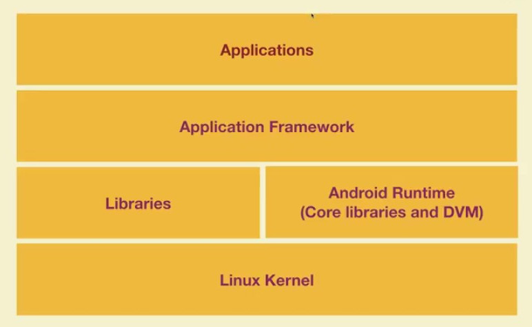

<div align="center">

[**_``Go Back``_**](../README.md)

# Introduction to Android Programming

</div>

## Android Platform
--------------------
``Android`` is a mobile operating system based on a modified version of the ``Linux`` kernel and other open-source software, designed primarily for touchscreen mobile devices such as smartphones and tablets. ``Android`` is developed by a consortium of developers known as the **``Open Handset Alliance``**, though its most widely used version is primarily developed by ``Google``. It was unveiled in November ``2007``, with the first commercial Android device, the ``HTC Dream``, being launched in September ``2008``.

## History of Android
----------------------
The history of ``Android`` dates back to ``2003`` when ``Andy Rubin``, ``Rich Miner``, ``Nick Sears``, and ``Chris White`` founded ``Android Inc.``, a company that developed software for mobile devices. In ``2005``, ``Google`` acquired ``Android Inc.`` and began developing a mobile operating system based on the ``Linux`` kernel.

The first version of ``Android``, ``Android 1.0``, was released in September ``2008`` on the ``HTC Dream``, also known as the ``T-Mobile G1``. ``Android 1.0`` was a basic operating system with basic functionality, such as a web browser, email client, and Google Maps.

In the following years, ``Google`` continued to release new versions of ``Android``, adding features and improving performance. Some notable releases include:

- **``Android 1.5 Cupcake (2009)``**: Introduced the on-screen keyboard, video recording, and support for widgets.

- **``Android 2.2 Froyo (2010)``**: Improved performance, added support for Adobe Flash, and introduced the ability to tether to a computer.

- **``Android 4.0 Ice Cream Sandwich (2011)``**: Introduced a new user interface design, support for face unlock, and added the ability to take screenshots.

- **``Android 5.0 Lollipop (2014)``**: Introduced a new Material Design user interface, improved performance, and added support for 64-bit processors.

- **``Android 6.0 Marshmallow (2015)``**: Added support for fingerprint sensors, improved battery life, and introduced the Now on Tap feature.

- **``Android 7.0 Nougat (2016)``**: Introduced split-screen multitasking, improved performance, and added support for virtual reality.

- **``Android 8.0 Oreo (2017)``**: Introduced picture-in-picture mode, notification channels, and improved battery life.

- **``Android 9.0 Pie (2018)``**: Introduced gesture navigation, Digital Wellbeing features, and improved security.

## Android Architecture
------------------------

Android architecture contains different number of components to support any android device needs. Android software contains an open-source Linux Kernel having collection of number of ``C/C++`` libraries which are exposed through an application framework services.

Among all the components ``Linux`` Kernel provides main functionality of operating system functions to smartphones and ``Dalvik Virtual Machine (DVM)`` provide platform for running an android application.

<div align="center">



</div>

The main components of android architecture are following:

- **Applications**
- **Application Framework**
- **Android Runtime**
- **Libraries**
- **Linux Kernel**

### **Applications**
Applications is the top layer of android architecture. The pre-installed applications like home, contacts, camera, gallery etc and third party applications downloaded from the play store like chat applications, games etc. will be installed on this layer only.

It runs within the Android run time with the help of the classes and services provided by the application framework.

### **Application framework**
Application Framework provides several important classes which are used to create an Android application. It provides a generic abstraction for hardware access and also helps in managing the user interface with application resources. Generally, it provides the services with the help of which we can create a particular class and make that class helpful for the Applications creation.

It includes different types of services activity manager, notification manager, view system, package manager etc. which are helpful for the development of our application according to the prerequisite.

### **Application runtime**
Android Runtime environment is one of the most important part of Android. It contains components like core libraries and the ``Dalvik Virtual Machine (DVM)``. Mainly, it provides the base for the application framework and powers our application with the help of the core libraries.

Like ``Java Virtual Machine (JVM)``, ``Dalvik Virtual Machine (DVM)`` is a register-based virtual machine and specially designed and optimized for android to ensure that a device can run multiple instances efficiently. It depends on the layer ``Linux`` kernel for threading and low-level memory management. The core libraries enable us to implement android applications using the standard ``JAVA`` or ``Kotlin`` programming languages.

### **Libraries**

The ``Platform Libraries`` includes various ``C/C++`` core libraries and Java based libraries such as Media, Graphics, Surface Manager, OpenGL etc. to provide a support for android development.

- ``Media`` library provides support to play and record an audio and video formats.
- ``Surface manager`` responsible for managing access to the display subsystem.
- ``SGL`` and ``OpenGL`` both cross-language, cross-platform application program interface (API) are used for 2D and 3D computer graphics.
- ``SQLite`` provides database support and ``FreeType`` provides font support.
- ``Web-Kit`` This open source web browser engine provides all the functionality to display web content and to simplify page loading.
- ``SSL (Secure Sockets Layer)`` is security technology to establish an encrypted link between a web server and a web browser.

### **Linux Kernel**

``Linux`` Kernel is heart of the android architecture. It manages all the available drivers such as display drivers, camera drivers, Bluetooth drivers, audio drivers, memory drivers, etc. which are required during the runtime.

The ``Linux`` Kernel will provide an abstraction layer between the device hardware and the other components of android architecture. It is responsible for management of memory, power, devices etc.

The features of Linux kernel are:

- **``Security``**: The ``Linux`` kernel handles the security between the application and the system.
- **``Memory Management``**: It efficiently handles the memory management thereby providing the freedom to develop our apps.
- **``Process Management``**: It manages the process well, allocates resources to processes whenever they need them.
- **``Network Stack``**: It effectively handles the network communication.
- **``Driver Model``**: It ensures that the application works properly on the device and hardware manufacturers responsible for building their drivers into the Linux build.

## Android View Hierarchy
------------------------
In Android development, a ``view hierarchy`` refers to the **hierarchical structure** of UI elements or "views" that make up the user interface of an Android app. Each element in the hierarchy is a view, which can be a simple widget like a button or a more complex container like a layout. The view hierarchy defines how these views are organized and nested within each other to create the visual layout of the app's user interface.

<div align="center">


</div>

Here is an example of a simple view hierarchy:

- ``RelativeLayout`` (Root)
    - ``EditText`` 
    - ``EditText``
    - ``Button`` 

Here's the XML code that corresponds to the given view hierarchy:

```Xml
<RelativeLayout xmlns:android="http://schemas.android.com/apk/res/android"
    android:layout_width="match_parent"
    android:layout_height="match_parent">

    <EditText
        android:layout_width="match_parent"
        android:layout_height="wrap_content"
        android:id="@+id/firstEditText"
        android:hint="Enter your username" />

    <EditText
        android:layout_width="match_parent"
        android:layout_height="wrap_content"
        android:layout_below="@id/firstEditText"
        android:id="@+id/secondEditText"
        android:hint="Enter your password" />

    <Button
        android:layout_width="wrap_content"
        android:layout_height="wrap_content"
        android:layout_below="@id/secondEditText"
        android:layout_centerHorizontal="true"
        android:id="@+id/loginButton"
        android:text="Login" />

</RelativeLayout>

```

Here:

- ``RelativeLayout (Root)``: This is the **top-level** layout container.

- ``EditText``: 

    - The **first** ``EditText`` is for entering a username. It spans the entire width of the parent and adjusts its height based on content.

    - The **second** ``EditText`` is for entering a password. 

- ``Button``: The Button for Login.