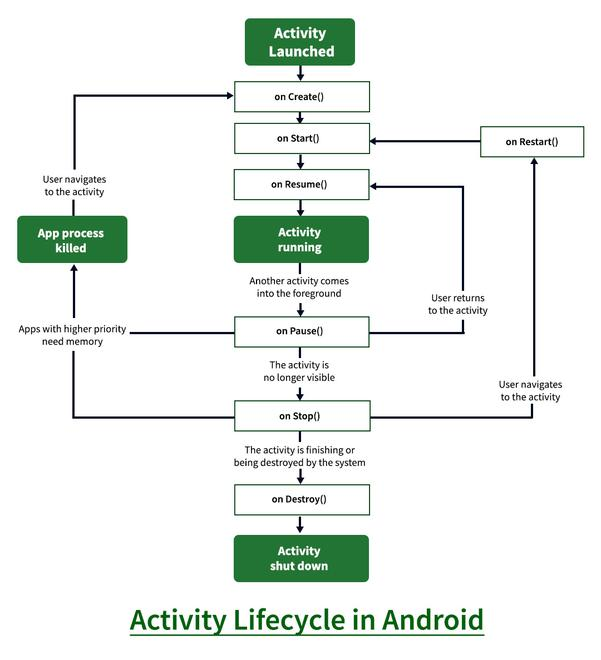
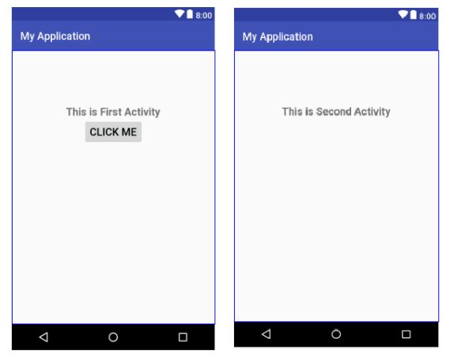

<div align="center">

[**_``Go Back``_**](../README.md)

# Android Activity

</div>

In Android, an ``Activity`` is a fundamental building block of an application's user interface. It represents a single screen with a user interface and can contain various UI elements, such as buttons, text fields, images, and more. Activities play a crucial role in providing the interactive and visual components of an app.

An activity is essentially a Java class that extends the ``android.app.Activity`` class. Each activity corresponds to a unique screen or window within the application. Activities are used to present different views to the user as they interact with the app, and they help manage the flow of the user interface.

The syntax for creating an Android activity involves defining a Java class that extends the ``android.app.Activity`` class and specifying the layout using an ``XML`` file. Here's the basic syntax:

**MainActivity.java**

```Java
import android.app.Activity;
import android.os.Bundle;

public class MainActivity extends Activity {

    @Override
    protected void onCreate(Bundle bundle) {
        super.onCreate(bundle);
        setContentView(R.layout.activity_main); // Set the layout XML file
        // Your initialization and logic code here
    }
    
    // Other lifecycle methods and additional code
}

```
**activity_main.xml**

```Xml
<?xml version="1.0" encoding="utf-8"?>

<LinearLayout xmlns:android="http://schemas.android.com/apk/res/android"
    android:layout_width="match_parent"
    android:layout_height="match_parent"
    android:orientation="vertical">
    <!-- Add your UI components here -->
</LinearLayout>
```


## The Android Activity Lifecycle
----------------------------------

In ``Android``, an activity is referred to as one screen in an application.

The ``Android`` activity lifecycle refers to the sequence of states that an Android activity goes through as it is **created**, **started**, **resumed**, **paused**, **stopped**, and **destroyed**. 

To navigate transitions between stages of the activity lifecycle, the ``Activity`` class provides a core set of 7 callbacks: **``onCreate()``**, **``onStart()``**, **``onResume()``**, **``onPause()``**, **``onStop()``**, **``onRestart()``** and **``onDestroy()``**. The system invokes each of these callbacks as the activity enters a new state.

<div align="center">



</div>

**Android Activity Lifecycle Methods:**
The ``7`` lifecycle method of ``Activity`` describes how activity will behave at different states.

When You Started an App:

- ``onCreate()``: called when activity is first created.
- ``onStart()``: called when activity is becoming visible to the user.
- ``onResume()``: called when activity will start interacting with the user.

If the app disrupts:

- ``onPause()``: called when activity is not visible to the user.
- ``onStop()``: called when activity is no longer visible to the user.
- ``onRestart()``: called after your activity is stopped, prior to start.
- ``onDestroy()``: called before the activity is destroyed.

These methods provide hooks into various points in the lifecycle of an Android activity, allowing you to manage the behavior of your app as it responds to user interactions and system events. 

## Creating multiple activities in android
-------------------------------------------

For this purpose, I am going create two activities having the name ``FirstActivity`` and ``SecondActivity``. ``FirstActivity`` contains ``TextView`` and ``Button``. On the other hand, ``SecondActivity`` contains a ``TextView``.

**FirstActivity.java**
```Java
import android.app.Activity;
import android.os.Bundle;
public class FirstActivity extends Activity {
    @Override
    protected void onCreate(Bundle savedInstanceState) {
        super.onCreate(savedInstanceState);
        setContentView(R.layout.first_activity);
    }
}
```

**SecondActivity.java**
```Java
import android.app.Activity;
import android.os.Bundle;
public class SecondActivity extends Activity {
    @Override
    protected void onCreate(Bundle b){
        super.onCreate(b);
        setContentView(R.layout.second_activity);
    }
}
```

**first_activity.xml**
```Xml
<?xml version="1.0" encoding="utf-8"?>
<LinearLayout
    xmlns:android="http://schemas.android.com/apk/res/android"
    android:layout_width="match_parent"
    android:layout_height="match_parent"
    android:orientation="vertical">
        
    <TextView
        android:layout_width="wrap_content"
        android:layout_height="wrap_content"
        android:text="This is First Activity"
        android:textSize="20sp"
        android:textStyle="bold"
        android:layout_gravity="center"
        android:layout_marginTop="100dp"
        android:id="@+id/text1"
        />

    <Button
        android:layout_width="wrap_content"
        android:layout_height="wrap_content"
        android:text="Click Me"
        android:textSize="20sp"
        android:layout_gravity="center"
        android:id="@+id/button1"
        />

</LinearLayout>
```

**second_activity.xml**
```Xml
<?xml version="1.0" encoding="utf-8"?>
<LinearLayout
    xmlns:android="http://schemas.android.com/apk/res/android"
    android:layout_width="match_parent"
    android:layout_height="match_parent"
    android:orientation="vertical">

    <TextView
        android:layout_width="wrap_content"
        android:layout_height="wrap_content"
        android:text="This is Second Activity"
        android:textSize="20sp"
        android:textStyle="bold"
        android:layout_gravity="center"
        android:layout_marginTop="100dp"
        android:id="@+id/text2"
        />

</LinearLayout>
```

**Output:**
<div align="center">



</div>

## Declaring Activities in Manifest
------------------------------------

Declaring activities in the ``AndroidManifest.xml`` file is crucial for the Android system to recognize and manage your app's activities. The ``AndroidManifest.xml`` file is the configuration file that provides essential information about your app to the Android system. Here's how you declare activities in the manifest:

- Inside the ``<application>`` element, add an ``<activity>`` element to declare your activity.

- The ``android:name`` attribute specifies the fully qualified class name of your activity (including the package name).

**AndroidManifest.xml:**

```Xml
<?xml version="1.0" encoding="utf-8"?>
<manifest>
    <application>

        <activity android:name=".FirstActivity">
            <intent-filter>
                <action android:name="android.intent.action.MAIN" />
                <category android:name="android.intent.category.LAUNCHER"/>
            </intent-filter>
        </activity>

        <activity android:name=".SecondActivity"/>
        
        <!-- Declare other activities as needed -->

    </application>
</manifest>
```

In above manifest file, FirstActivity contains ``<intent-filter>`` so, ``FirstActivity`` will be launched first when we run our application.

## Connecting Activities with Intents
--------------------------------------

An ``Intent`` in Android is a fundamental component that facilitates communication between different components of an ``Android`` application, as well as between different applications. It's a messaging object used to request an action, describe an operation to be performed, or carry data between various components, such as activities, services, and broadcast receivers. Intents are a crucial part of creating interactive and interconnected Android applications.

``Intents`` can be used for various purposes:

- **Starting Activities**: You can use an intent to launch a new activity or switch between different activities within your app.

- **Passing Data**: Intents are commonly used to send and receive data between activities. Data can be attached to an intent as extras.

- **Service Invocation**: Intents can start services, which are background processes that perform tasks without requiring a user interface.

- **Broadcasting**: Intents can be broadcast to multiple components, allowing broadcast receivers to react to system or app events.

- **Opening External Content**: You can use intents to open external content like websites, maps, emails, and more.

- **Implicit and Explicit Intents**: Intents can be ``explicit``, specifying the exact component to target, or ``implicit``, allowing the system to determine the best component to handle the intent based on its action and data.

The basic method signature of an intent in Android is as follows:

```Java
Intent intent = new Intent(Context packageContext, Class<?> cls);
```

Here :

- ``packageContext``: The context from which the intent is being sent, usually the current activity.
- ``cls``: The class of the component (activity, service, etc.) to which the intent is directed.


In Android, **``startActivity()``** is a method provided by the ``Context`` class, which is a fundamental class that provides access to various resources and components within an Android application. The **``startActivity()``** method is used to launch a new activity or perform an action that can be handled by an external component.

Here's the method signature of **``startActivity()``**:

```Java
void startActivity(Intent intent);
```
Here:

- **intent**: An ``Intent`` object that describes the activity you want to start or the action you want to perform.

When you call **``startActivity(intent)``**, you're telling the Android system to initiate the specified activity or action. The system then determines the appropriate component (usually an activity) to handle the intent based on its action and data.

**Example:**

Suppose you have an activity named ``FirstActivity`` and you want to start another activity named ``SecondActivity``.

**FirstActivity.java**
```Java
import android.app.Activity;
import android.os.Bundle;
import android.content.Intent;
import android.view.View;
import android.widget.Button;
public class FirstActivity extends Activity {
    @Override
    protected void onCreate(Bundle savedInstanceState) {
        super.onCreate(savedInstanceState);
        setContentView(R.layout.first_activity);
        Button btn=findViewById(R.id.button1);
        btn.setOnClickListener(new View.OnClickListener() {
            @Override
            public void onClick(View view) {
                Intent i=new Intent(FirstActivity.this,SecondActivity.class);
                startActivity(i);
            }
        });
    }
}
```

## Passing Data Between Activities
-----------------------------------

Passing data between activities is a common requirement in Android app development. You can use ``Intent`` objects to carry data from one activity to another.

The **``putExtra()``** method in Android's ``Intent`` class is used to attach extra data to an intent. It has various overloaded versions to accommodate different data types. Here's the basic method signature:

```Java
Intent putExtra(String name, [data type] value);
```
Here:

- ``name``: A string key that identifies the data being added.
- ``value``: The value of the data being added. The data type varies depending on the version of the **``putExtra()``** method you use.

Use:

```Java
intent.putExtra("key1", "Hello, this is a string");
intent.putExtra("key2", 42);
intent.putExtra("key3", true);
intent.putExtra("key4", 3.14f);
String[] stringArray = {"apple", "banana", "cherry"};
intent.putExtra("key5", stringArray);
```

The **``getIntent()``** method is a convenient method provided by the ``Activity`` class in Android. It allows you to retrieve the ``Intent`` that was used to start the current activity. Here's the method signature of **``getIntent()``**:

```Java
public Intent getIntent()
```

This method doesn't require any parameters. It simply returns the ``Intent`` that started the current activity.

To retrieve data that you've previously added using the **``putExtra()``** method, you'll use various get methods provided by the ``Intent`` class.

```Java
Intent intent = getIntent();
String data1 = intent.getStringExtra("key1");
int data2 = intent.getIntExtra("key2", defaultValue);
boolean data3 = intent.getBooleanExtra("key3", defaultValue);
float data4 = intent.getFloatExtra("key4", defaultValue);
String[] data5 = intent.getStringArrayExtra("key5");
```

Example:

- **Sending Data (Source Activity)**:To send data from the source activity, use the ``putExtra()`` methods of the ``Intent`` class. The data can be of various types, including primitive types, strings, arrays, and more.
    ```Java
    // In the source activity
    Intent intent = new Intent(SourceActivity.this, TargetActivity.class);
    intent.putExtra("keyName", value);
    startActivity(intent)
    ```

- **Receiving Data (Target Activity)**:In the target activity, retrieve the data using the **``getIntent()``** method and then use the appropriate get methods based on the data type.

    ```Java
    // In the target activity's onCreate() method
    Intent intent = getIntent();
    String receivedValue = intent.getStringExtra("keyName");
    ```

## Getting Result Back form Child Activity
-------------------------------------------

In Android, you can get results back from a child activity using the **``startActivityForResult()``** method and handling the result in the parent activity's **``onActivityResult()``** method. This is useful when you want to start an activity and get some data back from it.

Here's a step-by-step guide on how to achieve this:

- **Start Child Activity**: In your parent activity, when you want to start the child activity and expect a result, use the **``startActivityForResult()``** method. For example:

    ```Java
    // Inside ParentActivity.java
    Intent intent = new Intent(ParentActivity.this, ChildActivity.class);
    startActivityForResult(intent, REQUEST_CODE);
    ```

    Here, ``REQUEST_CODE`` is an integer that you define to identify this particular request.

- **Handle Result in Child Activity**: In the child activity, when you are done and want to return a result, you create an ``Intent`` with the result data and use **``setResult()``** before finishing the activity. For example:

    ```Java
    // Inside ChildActivity.java
    Intent resultIntent = new Intent();
    resultIntent.putExtra("resultKey", resultData);
    setResult(Activity.RESULT_OK, resultIntent);
    finish();
    ```

    Here, ``resultData`` is the data you want to send back to the parent activity.

- **Handle Result in Parent Activity**: Back in the parent activity, ``override`` the **``onActivityResult()``** method to handle the result from the child activity:

    ```Java
    // Inside ParentActivity.java
    @Override
    protected void onActivityResult(int requestCode, int resultCode, Intent data) {
        super.onActivityResult(requestCode, resultCode, data);

        if (requestCode == REQUEST_CODE) {
            if (resultCode == Activity.RESULT_OK) {
                // The result was successful, handle the data here
                String result = data.getStringExtra("resultKey");
                // Do something with the result
            } else if (resultCode == Activity.RESULT_CANCELED) {
                // The result was canceled or unsuccessful
            }
        }
    }
    ```
    In this method, you check if the ``requestCode`` matches the one you used when starting the child activity. Then, you check the ``resultCode`` to see if the result was successful or not, and if it was successful, you extract the data from the ``Intent`` using the key you provided when putting the data in the child activity.

That's it! This is how you can get results back from a child activity in Android.

Example:

**activity_first.xml**

```Xml
<?xml version="1.0" encoding="utf-8"?>
<RelativeLayout xmlns:android="http://schemas.android.com/apk/res/android"
    android:layout_width="match_parent"
    android:layout_height="match_parent"
    android:padding="16dp">

    <Button
        android:id="@+id/startChildButton"
        android:layout_width="wrap_content"
        android:layout_height="wrap_content"
        android:layout_centerInParent="true"
        android:text="Start Child Activity" />

    <TextView
        android:id="@+id/resultTextView"
        android:layout_width="wrap_content"
        android:layout_height="wrap_content"
        android:layout_below="@id/startChildButton"
        android:layout_centerHorizontal="true"
        android:layout_marginTop="16dp"
        android:text=""
        android:textSize="18sp" />
</RelativeLayout>
```

**FirstActivity.java**

```Java
import android.app.Activity;
import android.content.Intent;
import android.os.Bundle;
import android.view.View;
import android.widget.Button;
import android.widget.TextView;

public class FirstActivity extends Activity {
    private static final int REQUEST_CODE = 1; // Unique request code for identifying the child activity result
    private TextView resultTextView;

    @Override
    protected void onCreate(Bundle savedInstanceState) {
        super.onCreate(savedInstanceState);
        setContentView(R.layout.activity_first);

        resultTextView = findViewById(R.id.resultTextView);
        
        Button startChildButton = findViewById(R.id.startChildButton);
        startChildButton.setOnClickListener(new View.OnClickListener() {
            @Override
            public void onClick(View v) {
                Intent intent = new Intent(FirstActivity.this, SecondActivity.class);
                startActivityForResult(intent, REQUEST_CODE);
            }
        });
    }

    @Override
    protected void onActivityResult(int requestCode, int resultCode, Intent data) {
        super.onActivityResult(requestCode, resultCode, data);

        if (requestCode == REQUEST_CODE) {
            if (resultCode == RESULT_OK) {
                String result = data.getStringExtra("resultKey");
                resultTextView.setText("Result: " + result);
            } else if (resultCode == RESULT_CANCELED) {
                resultTextView.setText("Result: Canceled");
            }
        }
    }
}
```

**activity_second.xml**

```Xml
<?xml version="1.0" encoding="utf-8"?>
<RelativeLayout xmlns:android="http://schemas.android.com/apk/res/android"
    android:layout_width="match_parent"
    android:layout_height="match_parent"
    android:padding="16dp">

    <Button
        android:id="@+id/setResultButton"
        android:layout_width="wrap_content"
        android:layout_height="wrap_content"
        android:layout_centerHorizontal="true"
        android:layout_centerVertical="true"
        android:text="Set Result and Finish" />

    <Button
        android:id="@+id/cancelResultButton"
        android:layout_width="wrap_content"
        android:layout_height="wrap_content"
        android:layout_below="@id/setResultButton"
        android:layout_centerHorizontal="true"
        android:layout_marginTop="16dp"
        android:text="Cancel Result and Finish" />
</RelativeLayout>

```

**SecondActivity.java**

```Java
import android.app.Activity;
import android.content.Intent;
import android.os.Bundle;
import android.view.View;
import android.widget.Button;

public class SecondActivity extends Activity {
    @Override
    protected void onCreate(Bundle savedInstanceState) {
        super.onCreate(savedInstanceState);
        setContentView(R.layout.activity_second);

        Button setResultButton = findViewById(R.id.setResultButton);
        setResultButton.setOnClickListener(new View.OnClickListener() {
            @Override
            public void onClick(View v) {
                String resultData = "Data from SecondActivity";
                Intent resultIntent = new Intent();
                resultIntent.putExtra("resultKey", resultData);
                setResult(RESULT_OK, resultIntent);
                finish();
            }
        });

        Button cancelResultButton = findViewById(R.id.cancelResultButton);
        cancelResultButton.setOnClickListener(new View.OnClickListener() {
            @Override
            public void onClick(View v) {
                setResult(RESULT_CANCELED);
                finish();
            }
        });
    }
}
```

## Getting and Setting Data to/from Layout File
------------------------------------------------

Getting and setting data to/from a layout file in Android involves manipulating the UI elements within the layout through code. This is commonly done to update text, images, or other properties displayed to the user. 

In Android, the getters and setters methods you use depend on the specific UI elements you're working with. Here's a list of some common UI elements and their corresponding getter and setter methods:

- **EditText**:
    - Getter for text: **``getText()``**
    - Setter for text: **``setText(CharSequence text)``**

- **TextView**:
    - Getter for text: **``getText()``**
    - Setter for text: **``setText(CharSequence text)``**

- **ImageView**:
    - Getter for image resource: **``getImageResource()``**
    - Setter for image resource: **``setImageResource(int resId)``**
    - Getter for image drawable: **``getDrawable()``**
    - Setter for image drawable: **``setImageDrawable(Drawable drawable)``**
    - Getter for image bitmap: **``getBitmap()``**
    - Setter for image bitmap: **``setImageBitmap(Bitmap bitmap)``**

- **Button**:
    - Getter for text: **``getText()``**
    - Setter for text: **``setText(CharSequence text)``**

- **ToggleButton**:
    - Getter for checked state: **``isChecked()``**
    - Setter for checked state: **``setChecked(boolean checked)``**

- **SeekBar**:
    - Getter for progress: **``getProgress()``**
    - Setter for progress: **``setProgress(int progress)``**

- **Spinner**:
    - Getter for selected item position: **``getSelectedItemPosition()``**
    - Setter for selected item position: **``setSelection(int position)``**

- **CheckBox**:
    - Getter for checked state: **``isChecked()``**
    - Setter for checked state: **``setChecked(boolean checked)``**

- **RadioButton**:
    - Getter for checked state: **``isChecked()``**
    - bSetter for checked state: **``setChecked(boolean checked)``**

- **Switch**:
    - Getter for checked state: **``isChecked()``**
    - Setter for checked state: **``setChecked(boolean checked)``**

**Example:**

- **``Setting Data to Layout``**: You can set data to layout elements, such as **TextViews**, **ImageViews**, etc., by accessing them using their ``ID``s and then updating their properties.

    For example, if you have a ``TextView`` in your layout and you want to set a dynamic text to it, you can do the following:

    ```Java
    // Inside your activity code
    TextView textView = findViewById(R.id.myTextView); 
    String dynamicText = "Hello, World!";
    textView.setText(dynamicText);
    ```

- **``Getting Data from Layout``**: You can retrieve data from UI elements in the layout, such as **EditTexts**, **Spinners**, etc., by accessing them using their ``ID``s and retrieving their current values.

    For example, if you have an ``EditText`` in your layout and you want to get the text entered by the user, you can do the following:

    ```Java
    // Inside your activity code
    EditText editText = findViewById(R.id.myEditText);
    String userInput = editText.getText().toString();
    ```