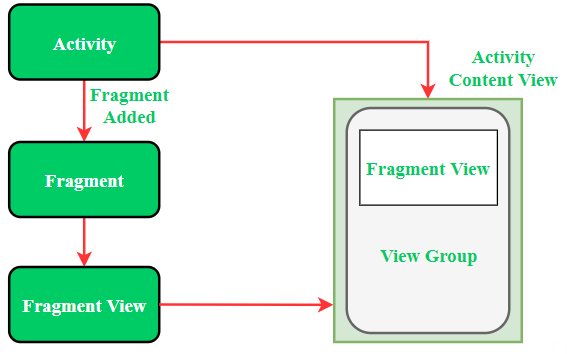
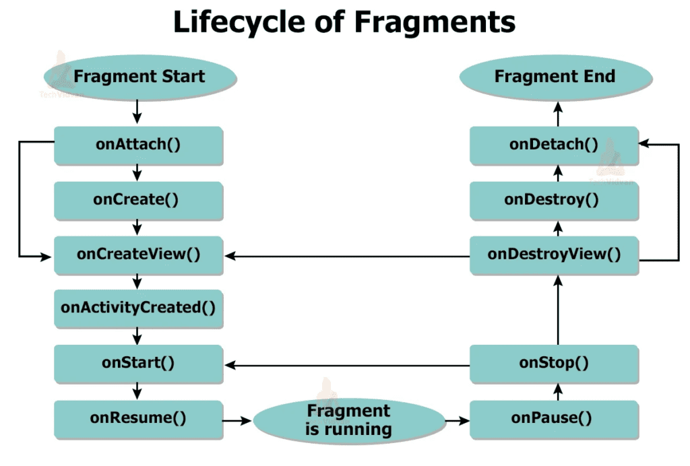

<div align="center">

[**_``Go Back``_**](../README.md)

# UI Fragments, Menus and Dialogs

</div>

## The need of UI Flexibility
------------------------------
In ``Android programming``, **UI flexibility** refers to the ability of the user interface (UI) components and layouts to adapt and respond effectively to different screen sizes, orientations, resolutions, and device configurations. It involves designing the UI in a way that ensures a consistent and user-friendly experience across a wide range of Android devices, including smartphones, tablets, wearables, and various form factors. **UI flexibility** is crucial in ``Android programming`` for several reasons:

- **``Device Diversity``**: Android runs on a vast array of devices with different screen sizes, resolutions, and aspect ratios. A flexible UI ensures your app looks and functions well across this diverse ecosystem.

- **``User Experience``**: A responsive and adaptable UI enhances the user experience by accommodating user preferences, accessibility needs, and changes in device orientation without causing usability issues.

- **``Global Reach``**: To cater to a global audience, your app should support multiple languages and cultures. UI flexibility allows for easy localization, ensuring your app can display content correctly in different languages and adapt to various writing systems.

- **``Future-Proofing``**: Android continually evolves with new devices, form factors, and operating system updates. A flexible UI design helps your app stay relevant and easily integrate new features without requiring a complete redesign.

- **``Accessibility Compliance``**: Android places a strong emphasis on accessibility features. A flexible UI layout is essential for implementing accessibility options, such as screen readers and scalable text, making your app inclusive and compliant with accessibility standards.

## Introduction to Fragment
----------------------------
In Android development, a ``Fragment`` is a modular and reusable portion of a user interface that represents a portion of an activity's UI or behavior. Fragments allow you to create flexible and responsive user interfaces, particularly for larger screens like tablets or when dealing with dynamic UI changes. Fragments can be thought of as self-contained UI components that can be combined and reused in different activities. Fragments can be added, removed, or replaced dynamically i.e., while activity is running. 

> ``<fragment>`` tag is used to insert the fragment in an android activity layout. By dividing the activity’s layout multiple fragments can be added in it.

Below is the pictorial representation of fragment interaction with the activity:

<div align="center">



</div>

**Types of Android Fragments:**

- **Single Fragment**: Display only one single view on the device screen. This type of fragment is mostly used for mobile phones.

- **List Fragment**: This ``Fragment`` is used to display a list-view from which the user can select the desired sub-activity. The menu drawer of apps like Gmail is the best example of this kind of fragment.

- **Fragment Transaction**: This kind of fragments supports the transition from one fragment to another at run time. Users can switch between multiple fragments like switching tabs.

## Lifecycle of Fragment
-------------------------

The ``Fragment Lifecycle`` is the series of states that a fragment goes through during its lifetime.

> ``Note:`` Each fragment has it’s own lifecycle but due to the connection with the **Activity** it belongs to, the fragment lifecycle is influenced by the activity’s lifecycle.

<div align="center">



</div>

**Lifecycle Methods:**

- **``onAttach(Activity)``**: This method is called when the fragment is first attached to an activity.

- **``onCreate(Bundle)``**: This method is called when the fragment is created.

- **``onCreateView(LayoutInflater, ViewGroup, Bundle)``**: This method is called when the fragment's view is created.

- **``onActivityCreated(Bundle)``**: This method is called when the activity's onCreate() method has returned.

- **``onViewStateRestored(Bundle)``**: It provides information to the fragment that all the saved state of fragment view hierarchy has been restored.

- **``onStart()``**: This method is called when the fragment is started.

- **``onResume()``**: This method is called when the fragment is resumed.

- **``onPause()``**: This method is called when the fragment is paused.

- **``onStop()``**: This method is called when the fragment is stopped.

- **``onDestroyView()``**: This method is called when the fragment's view is destroyed.

- **``onDestroy()``**: This method is called when the fragment is destroyed.

- **``onDetach()``** : It is called immediately prior to the fragment no longer being associated with its activity.

## Creating a UI Fragment 
--------------------------
Creating a **UI fragment** in ``Android`` involves creating a reusable portion of your app's user interface that can be combined with other fragments to build a complete UI. ``Fragments`` are commonly used to create more modular and flexible layouts, especially for apps that run on both phones and tablets.

Here's a **step-by-step** guide on how to create a **UI fragment** in Android:

### Create a new Fragment class:

In your **Android project**, create a new Java class that extends the ``Fragment`` class. This class will represent your UI fragment.

### Implement the ``onCreateView()`` method:

Override the ``onCreateView()`` method within your fragment class. This is where you'll inflate the fragment's layout and configure its UI components.

```Java
public class MyFragment extends Fragment {
    @Nullable
    @Override
    public View onCreateView(LayoutInflater inflater, @Nullable ViewGroup container, @Nullable Bundle savedInstanceState) {
        View rootView = inflater.inflate(R.layout.fragment_layout, container, false);
        // Initialize and configure UI components
        return rootView;
    }
}
```
### Create the fragment layout:
Create an XML layout file in the ``res/layout`` directory of your project. This layout will define the UI elements for your fragment.

```Xml
<!-- fragment_layout.xml -->
<LinearLayout xmlns:android="http://schemas.android.com/apk/res/android"
    android:layout_width="match_parent"
    android:layout_height="match_parent"
    android:orientation="vertical">
    <!-- Add your UI components here -->
</LinearLayout>
```

### Add the fragment to an activity:
To display the fragment, you need to add it to an activity's layout. You can do this either in the XML layout file or programmatically within the activity's code.

**XML Approach:**
```Xml
<Fragment
    android:id="@+id/fragment_container"
    android:layout_width="match_parent"
    android:layout_height="match_parent" />
```

**Activity Code:**
```Java
FragmentManager fragmentManager = getSupportFragmentManager();
FragmentTransaction fragmentTransaction = fragmentManager.beginTransaction();
fragmentTransaction.replace(R.id.fragment_container, new MyFragment());
fragmentTransaction.commit();
```
### Interact with the Fragment:
You can communicate between the fragment and the hosting activity using interfaces or ViewModel, depending on your architecture.

## Wiring widgets in Fragment
---------------------------------
Wiring widgets in an Android fragment involves finding and interacting with UI elements (widgets) that are part of the fragment's layout. Here's how you can wire widgets in a fragment:

### Inflate Layout and Find Widgets:
In the **``onCreateView()``** method of your fragment, inflate the fragment's layout and find the required widgets using their unique IDs.

```Java
public class MyFragment extends Fragment {
    @Nullable
    @Override
    public View onCreateView(LayoutInflater inflater, @Nullable ViewGroup container, @Nullable Bundle savedInstanceState) {
        View rootView = inflater.inflate(R.layout.fragment_layout, container, false);
        // Find widgets by their IDs
        Button button = rootView.findViewById(R.id.button_id);
        EditText editText = rootView.findViewById(R.id.editText_id);
        // Set listeners or perform actions on widgets
        button.setOnClickListener(new View.OnClickListener() {
            @Override
            public void onClick(View v) {
                // Handle button click
            }
        });
        return rootView;
    }
}
```

### Set Listeners and Perform Actions:
After finding the widgets, you can set listeners on them to respond to user interactions. For example, setting a click listener on a button to perform an action when the button is clicked.

```Java
button.setOnClickListener(new View.OnClickListener() {
    @Override
    public void onClick(View v) {
        String inputText = editText.getText().toString();
        // Perform some action with the input text
    }
});
```

### Accessing Widgets Outside ``onCreateView()``:
If you need to access the widgets from other methods within the fragment, you can declare them as instance variables at the fragment level. Initialize them in **``onCreateView()``** and then use them across the fragment's methods.

```Java
public class MyFragment extends Fragment {
    private Button button;
    private EditText editText;
    @Nullable
    @Override
    public View onCreateView(LayoutInflater inflater, @Nullable ViewGroup container, @Nullable Bundle savedInstanceState) {
        View rootView = inflater.inflate(R.layout.fragment_layout, container, false);
        
        // Find widgets by their IDs
        button = rootView.findViewById(R.id.button_id);
        editText = rootView.findViewById(R.id.editText_id);
        
        button.setOnClickListener(new View.OnClickListener() {
            @Override
            public void onClick(View v) {
                String inputText = editText.getText().toString();
                // Perform some action with the input text
            }
        });
        
        return rootView;
    }
    // You can access button and editText from other methods in this class
}
```


## Introduction to FragmentManager
-----------------------------------
The ``FragmentManager`` in Android is a crucial component responsible for managing fragments within an activity. It helps you add, replace, remove, and manipulate fragments during runtime, enabling dynamic UI changes and interaction within your app.

**Funtions of FragmentManager:**

- **``Fragment Transactions``**: Enables **adding**, **replacing**, and **removing** fragments dynamically within an activity's layout.

- **``Back Stack Management``**: Manages a back stack of fragment transactions, allowing navigation through transaction history.

- **``Fragment Lifecycle Management``**: Automatically handles calling fragment lifecycle methods during transitions.

- **``Fragment Retrieval``**: Provides methods to find and retrieve fragments by ID or tag.

- **``Nested Fragment Support``**: Supports managing fragments within fragments, enhancing UI modularity and complexity.

**Accessing from Activity:**

You can obtain a reference to the ``FragmentManager`` of an activity using the **``getFragmentManager()``** method if you're targeting older Android versions (pre-API level 28).

```Java
FragmentManager fragmentManager = getFragmentManager();
```
Or, if you're targeting API level 28 and higher, you can use the **``getSupportFragmentManager()``** method from the ``AppCompatActivity`` class (part of the ``AndroidX`` library) for better compatibility.

```Java
FragmentManager fragmentManager = getSupportFragmentManager();
```

**Accessing from Fragment:**

Within a fragment, you can obtain a reference to the ``FragmentManager`` using the **``getChildFragmentManager()``** method. This is especially useful when dealing with nested fragments.

```Java
FragmentManager fragmentManager = getChildFragmentManager();
```

**Key Methods:**

- **``beginTransaction()``**: Starts a new fragment transaction. You can perform a series of fragment-related operations within this transaction and then commit them all at once.

- **``add(int containerViewId, Fragment fragment)``**: Adds a fragment to the activity's layout. You specify the container ID and the fragment instance to be added.

- **``replace(int containerViewId, Fragment fragment)``**: Replaces an existing fragment in the activity's layout with a new fragment. You specify the container ID and the new fragment instance.

- **``remove(Fragment fragment)``**: Removes a fragment from the layout.

- **``addToBackStack(String name)``**: Adds the current transaction to the back stack, allowing users to navigate back through transaction history.

- **``popBackStack(String name, int flags)``**: Pops fragments off the back stack, optionally allowing you to navigate to a specific state in the back stack.

- **``commit()``**: Commits the transaction and applies all operations.

## Differentiate Activity and Fragment along with its life cycle
----------------------------------------------------------------

| Aspect                 | Activity                                           | Fragment                                                          |
|------------------------|----------------------------------------------------|-------------------------------------------------------------------|
| Definition             | Represents a single screen with UI.                | Represents a portion of UI within an activity.                    |
| Relationship           | Can contain fragments.                             | Belongs to an activity.                                           |
| **Life Cycle Stages :**|                                                    |                                                                   |
| `onAttach()`           | `onAttach(Context context)` method available.      | Called when the fragment is attached to an activity.              |
| `onCreate()`           | Initializes the activity.                          | Initializes the fragment.                                         |
| `onCreateView()`       | Not applicable.                                    | Creates the UI for the fragment.                                  |
| `onStart()`            | Activity becomes visible.                          | Fragment becomes visible.                                         |
| `onResume()`           | Activity is in the foreground, interacting.        | Fragment actively interacts with the user.                        |
| `onPause()`            | Activity loses focus, but remains attached.        | Fragment loses focus, but remains attached.                       |
| `onStop()`             | Activity is no longer visible.                     | Fragment is no longer visible.                                    |
| `onDestroy()`          | Activity is being destroyed.                       | Not applicable (use `onDestroyView()`).                           |
| `onDestroyView()`      | Not applicable.                                    | Fragment's UI is being destroyed.                                 |
| `onDetach()`           | Not applicable.                                    | Fragment is detached from the activity.                           |
|                        |                                                    |                                                                   |
| Use Cases              | Creating main screens, handling navigation.        | Creating reusable UI components.                                  |
| Communication          | Activities communicate through intents, callbacks. | Fragments communicate through the hosting activity or interfaces. |
| Flexibility            | Less flexible for modular UI design.               | Provides modular and flexible UI design.                          |

## Menus
-----------

### **Introduction**

In ``Android``, **Menus** are **user interface components** that provide a way for users to access various actions, commands, settings, or options within an app. **Menus** are used to organize and present functionality in a user-friendly and structured manner. 

### **Types**


In Android, there are several types of ``Menus`` that you can use to provide various options and actions to users within your app. The main types of menus in Android are:

- **``Options Menu``** (**App Bar Menu**):
    - **Options menu** is typically displayed in the app bar (formerly known as the action bar) at the top of the screen.
    - It provides access to common actions and settings relevant to the current screen or context within the app.
    - Items in the options menu can include actions like **New**, **Save**, **Settings**, **Search** and **Share**.
    - Options menus are often used for actions that are universally accessible throughout the app.

- **``Context Menu``**:
    - **Context menus** are typically invoked by long-pressing on a UI element, such as a list item, button, or view.
    - They offer context-specific actions that are relevant to the selected element.
    - **Context menus** are often used for actions that are specific to the item or view that the user interacts with, such as **Edit**, **Delete**, or **Copy**

- **``Popup Menu``**:
    - **Popup menus** are similar to context menus but are usually triggered by tapping a button or icon rather than a long-press gesture.
    - They provide a list of options or actions that are related to the button or icon that triggers them.
    - Popup menus are often used for actions like sorting, filtering, or changing view options.

### **Implementing menu in an Application**

To implement menus in an Android application, you typically follow these steps:

#### Define the Menu XML Resource:

Create an ``XML`` resource file in the ``res/menu/`` directory of your Android project to define the menu items and their properties.

Here's an example of a simple menu ``XML`` file (``res/menu/main_menu.xml``):

```Xml
<menu xmlns:android="http://schemas.android.com/apk/res/android">
    <item
        android:id="@+id/action_settings"
        android:title="Settings"
        android:icon="@drawable/ic_settings"
        android:orderInCategory="100"
        app:showAsAction="never" />
    <!-- Add more menu items as needed -->
</menu>
```
#### Inflate the Menu in the Activity:

In your ``MainActivity.java`` file, override the ``onCreateOptionsMenu()`` method to inflate the menu ``XML`` resource:

```Java
import android.os.Bundle;
import android.view.Menu;
import android.view.MenuItem;
import androidx.appcompat.app.AppCompatActivity;

public class MainActivity extends AppCompatActivity {

    @Override
    protected void onCreate(Bundle savedInstanceState) {
        super.onCreate(savedInstanceState);
        setContentView(R.layout.activity_main);
    }

    @Override
    public boolean onCreateOptionsMenu(Menu menu) {
        getMenuInflater().inflate(R.menu.main_menu, menu);
        return true;
    }
}

```
#### Handle Menu Item Selections:

Override the ``onOptionsItemSelected()`` method to handle actions when a menu item is selected. This is where you specify what should happen when a user taps a menu item.

```Java
import android.os.Bundle;
import android.view.Menu;
import android.view.MenuItem;
import androidx.appcompat.app.AppCompatActivity;

public class MainActivity extends AppCompatActivity {

    @Override
    protected void onCreate(Bundle savedInstanceState) {
        super.onCreate(savedInstanceState);
        setContentView(R.layout.activity_main);
    }

    @Override
    public boolean onCreateOptionsMenu(Menu menu) {
        getMenuInflater().inflate(R.menu.main_menu, menu);
        return true;
    }

    @Override
    public boolean onOptionsItemSelected(MenuItem item) {
        int id = item.getItemId();
        if (id == R.id.action_settings) {
            // Handle the "Settings" menu item click here
            // For this example, we'll display a toast message
            Toast.makeText(this, "Settings clicked", Toast.LENGTH_SHORT).show();
            return true;
        }
        // Handle other menu items as needed
        return super.onOptionsItemSelected(item);
    }
}
```

#### Modify the Layout (Optional)

Modify the layout of ``activity_main.xml`` to include a button or any other UI element that will trigger the options menu. For example:

```Xml
<!-- res/layout/activity_main.xml -->
<RelativeLayout 
    xmlns:android="http://schemas.android.com/apk/res/android"
    android:layout_width="match_parent"
    android:layout_height="match_parent"
    android:padding="16dp"
    tools:context=".MainActivity">

    <Button
        android:id="@+id/show_menu_button"
        android:layout_width="wrap_content"
        android:layout_height="wrap_content"
        android:text="Show Menu" />
</RelativeLayout>
```
#### Handle Button Click (Optional)

In the ``MainActivity.java`` file, you can handle the button click event to programmatically open the options menu.

```Java
import android.os.Bundle;
import android.view.Menu;
import android.view.MenuItem;
import androidx.appcompat.app.AppCompatActivity;

public class MainActivity extends AppCompatActivity {

    @Override
    protected void onCreate(Bundle savedInstanceState) {
        super.onCreate(savedInstanceState);
        setContentView(R.layout.activity_main);
        Button showMenuButton = findViewById(R.id.show_menu_button);
        showMenuButton.setOnClickListener(new View.OnClickListener() {
        @Override
            public void onClick(View v) {
                // Programmatically open the options menu
                openOptionsMenu();
            }
        });
    }

    @Override
    public boolean onCreateOptionsMenu(Menu menu) {
        getMenuInflater().inflate(R.menu.main_menu, menu);
        return true;
    }

    @Override
    public boolean onOptionsItemSelected(MenuItem item) {
        int id = item.getItemId();
        if (id == R.id.action_settings) {
            // Handle the "Settings" menu item click here
            // For this example, we'll display a toast message
            Toast.makeText(this, "Settings clicked", Toast.LENGTH_SHORT).show();
            return true;
        }
        // Handle other menu items as needed
        return super.onOptionsItemSelected(item);
    }
}
```

## Dialog
-----------

### **Introduction**

In Android, a ``Dialog`` is a small window or pop-up interface element that is used to interact with the user and provide information, gather input, or perform actions within an app. ``Dialogs`` are typically displayed on top of the current screen or activity, and they temporarily interrupt the user's workflow until they are dismissed.

**Types of Dialog**

There are several types of dialogs available in Android, including:

- **``AlertDialog``**: A simple dialog box that displays a message to the user along with buttons for actions such as **OK**, **Cancel** or **Dismiss**.

- **``ProgressDialog``**: A dialog that shows a progress indicator to inform the user about the status of an ongoing operation, such as downloading a file or processing data.

- **``DatePickerDialog``**: Allows the user to select a date from a calendar-like interface.

- **``TimePickerDialog``**: Allows the user to select a time using a clock-like interface.

- **``Custom Dialog``**: A customized dialog that can be designed to include various UI elements such as text fields, buttons, and images, tailored to the specific needs of the app.

### **Creating a Dialog Fragmant**

#### Create a Dialog Fragment Class:
Create a Java class that extends ``DialogFragment``. This class will define the appearance and behavior of your dialog.

```Java
public class MyDialogFragment extends DialogFragment {
    // Define your dialog's content and behavior here
}
```
#### Override onCreateDialog Method: 
Inside your ``DialogFragment`` class, override the **``onCreateDialog()``** method. This method is where you set up the dialog's appearance and functionality.

```Java
public class MyDialogFragment extends DialogFragment {
    @Override
    public Dialog onCreateDialog(Bundle savedInstanceState) {
        AlertDialog.Builder builder = new AlertDialog.Builder(getActivity());
        builder.setTitle("My Dialog")
            .setMessage("This is a dialog fragment.")
            .setPositiveButton("OK", new DialogInterface.OnClickListener() {
                public void onClick(DialogInterface dialog, int which) {
                    // Handle positive button click
                }
            })
            .setNegativeButton("Cancel", new DialogInterface.OnClickListener() {
                public void onClick(DialogInterface dialog, int which) {
                    // Handle negative button click
                }
            });
        return builder.create();
    }
}
```
In the **onCreateDialog()** method, you can use an ``AlertDialog.Builder`` to create and configure your dialog.

#### Show the Dialog: 
To display your dialog, you can instantiate your ``DialogFragment`` and call show from an activity or another fragment.

```Java
MyDialogFragment dialogFragment = new MyDialogFragment();
dialogFragment.show(getSupportFragmentManager(), "MyDialogFragment");
```

Replace **``getSupportFragmentManager()``** with **``getFragmentManager()``** if you are using the deprecated ``FragmentManager``.

### **Setting a Dialog Content**

To create a custom dialog with your own layout, follow these steps:

#### Create a custom XML layout file:
Create an ``XML`` layout file for your custom dialog content. For example, ``custom_dialog.xml``.

```Xml
<!-- custom_dialog.xml -->
<LinearLayout
    xmlns:android="http://schemas.android.com/apk/res/android"
    android:layout_width="match_parent"
    android:layout_height="wrap_content"
    android:orientation="vertical">
    <!-- Add your custom content here -->
    <TextView
        android:id="@+id/custom_text"
        android:layout_width="wrap_content"
        android:layout_height="wrap_content"
        android:text="Custom Dialog Content" />
    <!-- You can add more views as needed -->
</LinearLayout>
```

#### Inflate the custom layout in your DialogFragment:

```Java
public class CustomDialogFragment extends DialogFragment {
    @Override
    public View onCreateView(LayoutInflater inflater, ViewGroup container, Bundle savedInstanceState) {
        View view = inflater.inflate(R.layout.custom_dialog, container, false);
        
        // You can access and customize the views in your custom layout
        TextView textView = view.findViewById(R.id.custom_text);
        textView.setText("Updated Text");

        return view;
    }
}
```

#### Show the DialogFragment:

```Java
CustomDialogFragment dialogFragment = new CustomDialogFragment();
dialogFragment.show(getSupportFragmentManager(), "CustomDialogFragment");
```