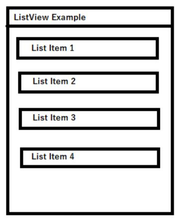
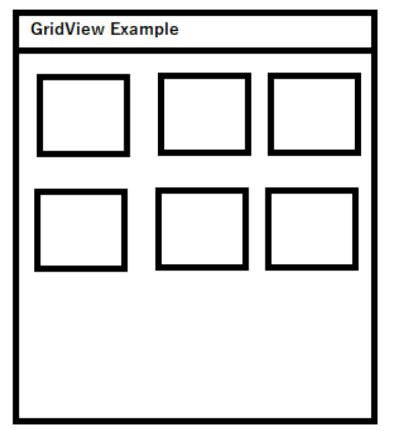

<div align="center">

[**_``Go Back``_**](../README.md)

# ListView, GridView and RecyclerView

</div>

## ListView
-------------

### **Introduction**

In Android, a ``ListView`` is a fundamental user interface component used to display a scrollable list of items. Each item in the list is represented as a single row, and users can scroll through the list to view all the items. The ``ListView`` is often used to present data in an organized and easily accessible manner, such as displaying contact names, messages, or any kind of list-based content.

<div align="center">



</div>

**Attributes:**

- ``android:divider`` : A color or drawable to separate list items.
- ``android:dividerHeight`` : Divider’s height.
- ``android:entries`` : Reference to an array resource that will populate the **ListView**.
- ``android:footerDividersEnabled`` : When set to ``false``, the **ListView** will not draw the divider before each footer view.
- ``android:headerDividersEnabled`` : When set to ``false``, the **ListView** will not draw the divider before each header view.

### **Features**

- **``Scrollable List``**: The primary purpose of ``ListView`` is to present a long list of items in a scrollable manner, allowing users to view all items even if they don't fit on the screen.

- **``Adapter-based``**: ``ListView`` uses an adapter to provide data and generate views for each item in the list. This separation of data and presentation allows for efficient recycling of views as the user scrolls.

- **``Reusability and Efficiency``**: ``ListView`` recycles item views as users scroll. This helps save memory and improves performance by reusing views instead of creating new ones for every item.

- **``Choice Modes``**: ``ListView`` supports different selection modes, such as **single choice**, **multiple choice**, and **no choice**. This is useful for scenarios like selecting items from a list.

- **``Custom Item Layouts``**: You can create custom layouts for individual items in the list, allowing for flexible design and display of various UI elements like text views, image views, buttons, etc.

- **``ItemClick Handling``**: ``ListView`` provides a way to handle item clicks using an **``OnItemClickListener``**, allowing you to respond to user interactions on specific list items.

### **Implementing ListView in an Application**

#### Add a ListView in the Layout

```XML
<?xml version="1.0" encoding="utf-8"?>
<LinearLayout
	android:layout_width="match_parent"
	android:layout_height="match_parent"
	tools:context=".MainActivity">

	<ListView
		android:id="@+id/list"
		android:layout_width="match_parent"
		android:layout_height="match_parent"/>
</LinearLayout>
```

#### Modify Java Activity file

Now in the ``Activity`` create a string array and store the values you want to display in the list. Also, create an object of ``ListView`` class. In **``onCreate()``** method find ``Listview`` by id using ``findViewById()`` method. Create an object of ``ArrayAdapter`` using a new keyword followed by a constructor call. The ``ArrayAdaptor`` public constructor description is below:

```Java
public ArrayAdapter (Context context, int Resource, T[ ] objects)
```

- **context** : current context
- **Resource** : the resource ID for a layout file
- **objects** : objects to display in the ``ListView``

According to this pass the argument in ArrayAdapter Constructor and create an object. At last, conjoin the adapter with the list using ``setAdapter()`` method.

```Java
import android.os.Bundle;
import android.widget.ArrayAdapter;
import android.widget.ListView;
import androidx.appcompat.app.AppCompatActivity;

public class MainActivity extends AppCompatActivity {

    private String[] programmingLanguages = {
        "Java",
        "Python", 
        "C++",
        "JavaScript",
        "Swift",
        "Ruby", 
        "Kotlin", 
        "PHP"
    };

    @Override
    protected void onCreate(Bundle savedInstanceState) {
        super.onCreate(savedInstanceState);
        setContentView(R.layout.activity_main);
        ListView listView = findViewById(R.id.list);
        ArrayAdapter<String> adapter = new ArrayAdapter<>(
            this,
            android.R.layout.simple_list_item_1,
            programmingLanguages
        );
        listView.setAdapter(adapter);
    }
}
```

## GridView
-------------

### **Introduction**

A ``GridView`` is a UI component in Android that displays a **two-dimensional** grid of items, similar to a table or a spreadsheet. It's used to present data in a grid format, where each cell in the grid can contain various types of content like text, images, buttons, or any other UI element. The GridView allows users to scroll through the grid horizontally or vertically to view all the items.

<div align="center">



</div>

**Attributes:**

- ``android:columnWidth`` : Specifies the fixed width for each column.
- ``android:rowHeight`` : Sets the height of each row in the grid.
- ``android:gravity`` : Specifies the gravity within each cell.
- ``android:horizontalSpacing`` : Defines the default horizontal spacing between columns.
- ``android:numColumns`` : Defines how many columns to show.
- ``android:stretchMode`` : Defines how columns should stretch to fill the available empty space, if any.
- ``android:verticalSpacing`` : Defines the default vertical spacing between rows.


### **Features**

- **``Grid Layout for Structured Data``** : The primary purpose of ``GridView`` is to present data in a structured grid layout. It organizes items into **rows** and **columns**, making it ideal for displaying collections of items like photos, product listings, or any data that can be logically organized.

- **``Item Recycling and Efficiency``** : Like other adapter-based views in Android, ``GridView`` efficiently recycles views as the user scrolls. This recycling mechanism minimizes memory usage and enhances performance, especially when dealing with large datasets.

- **``Customizable Item Layouts``** : Each grid item can have a custom layout defined in an XML file. This means you can create visually diverse grids with each item containing a combination of text, images, buttons, and other UI elements.

- **``SelectionMode and Item Click Handling``** : ``GridView`` supports selection modes, allowing you to handle single or multiple item selections. You can also set an OnItemClickListener to respond to user clicks on individual grid items, making the grid interactive.

- **``GridLayout and StaggeredGrid Layout``** : ``GridView`` offers flexibility in terms of layout. You can use ``GridLayout`` to customize the arrangement of items using **rows** and **columns**. Alternatively, you can use the ``StaggeredGridLayoutManager`` to create a more dynamic layout where items in a row can have varying heights.

### **Implementing GridView in an Application**

**activity_main.xml:**
```XML
<?xml version="1.0" encoding="utf-8"?>
<LinearLayout
	android:layout_width="match_parent"
	android:layout_height="match_parent"
	tools:context=".MainActivity">
    <GridView
        android:id="@+id/gridView"
        android:layout_width="match_parent"
        android:layout_height="match_parent"
        android:numColumns="auto_fit"
        android:columnWidth="300dp"
        android:horizontalSpacing="16dp"
        android:verticalSpacing="16dp"/>
</LinearLayout>
```

**student_grid_item.xml:**
```XML
<LinearLayout
    xmlns:android="http://schemas.android.com/apk/res/android"
    android:layout_width="wrap_content"
    android:layout_height="wrap_content"
    android:orientation="vertical"
    android:padding="16dp">
    <TextView
        android:id="@+id/studentName"
        android:layout_width="wrap_content"
        android:layout_height="wrap_content"
        android:textSize="16sp"
        android:textStyle="bold"/>
    <TextView
        android:id="@+id/studentAddress"
        android:layout_width="wrap_content"
        android:layout_height="wrap_content"
        android:textSize="14sp"/>
</LinearLayout>
```

**Student.java**:
```Java
public class Student {

    private String name;
    private String address;

    public Student(String name, String address) {
        this.name = name;
        this.address = address;
    }

    public String getName() {
        return name;
    }

    public String getAddress() {
        return address;
    }
}
```

**CustomAdapter.java:**
```Java
import android.content.Context;
import android.view.LayoutInflater;
import android.view.View;
import android.view.ViewGroup;
import android.widget.BaseAdapter;
import android.widget.TextView;
import java.util.List;

public class CustomAdapter extends BaseAdapter {

    private Context context;
    private List<Student> students;

    public CustomAdapter(Context context, List<Student> students) {
        this.context = context;
        this.students = students;
    }

    @Override
    public int getCount() {
        return students.size();
    }

    @Override
    public Object getItem(int position) {
        return students.get(position);
    }

    @Override
    public long getItemId(int position) {
        return position;
    }

    @Override
    public View getView(int position, View convertView, ViewGroup parent) {
        LayoutInflater inflater = LayoutInflater.from(context);
        View itemView = inflater.inflate(R.layout.student_grid_item, parent, false);

        TextView studentNameTextView = itemView.findViewById(R.id.studentName);
        TextView studentAddressTextView = itemView.findViewById(R.id.studentAddress);

        Student student = students.get(position);
        studentNameTextView.setText(student.getName());
        studentAddressTextView.setText(student.getAddress());

        return itemView;
    }
}
```

**MainActivity.Java:**
```Java
import android.os.Bundle;
import android.support.v7.app.AppCompatActivity;
import android.widget.GridView;
import java.util.ArrayList;
import java.util.List;

public class MainActivity extends AppCompatActivity {

    @Override
    protected void onCreate(Bundle savedInstanceState) {
        super.onCreate(savedInstanceState);
        setContentView(R.layout.activity_main);
        GridView gridView = findViewById(R.id.gridView);
        List<Student> students = new ArrayList<>();
        students.add(new Student("Prashant", "Birtamode"));
        students.add(new Student("Ram", "Taplejung"));
        students.add(new Student("Shyam", "Kathmandu"));
        CustomAdapter adapter = new CustomAdapter(this, students);
        gridView.setAdapter(adapter);
    }
}
```

## RecyclerView
----------------

### **Introduction**

The ``RecyclerView`` is a powerful and flexible UI component introduced in Android as an improvement over the older ``ListView`` and ``GridView`` components. It's designed to efficiently display large datasets while providing more control over item layouts, animations, and interactions. The ``RecyclerView`` is a fundamental part of modern Android app development, and it offers several advantages over its predecessors. 

### **Features**

- **``Efficient Item Recycling``**: The ``RecyclerView`` efficiently recycles and reuses views as users scroll through a list of items. This recycling mechanism significantly reduces memory usage and improves performance, especially when dealing with large datasets.

- **``LayoutManager Flexibility``**: The ``RecyclerView`` supports different ``LayoutManager`` implementations, such as ``LinearLayoutManager``, ``GridLayoutManager``, and ``StaggeredGridLayoutManager``. This flexibility enables developers to create various layouts, including vertical and horizontal lists, grids, and staggered grids.

- **``ViewHolder Pattern``**: The ``ViewHolder`` pattern is enforced in the ``RecyclerView``, improving memory efficiency and reducing the overhead of inflating views. ViewHolders are used to cache references to views within each item view.

- **``Item Animations and Decorations``**: The built-in support for item animations and decorations enhances the visual appeal of the user interface. Animations for adding, removing, and changing items can be customized, and ItemDecoration can be added to style items with dividers, spacing, and custom decorations.

- **``ItemClick Handling and Interaction``**: The ``RecyclerView`` simplifies item click handling through its built-in ``ItemClickListener`` and ``ItemLongClickListener``. Developers can also implement interactive features like **swipe-to-dismiss** and **drag-and-drop** reordering with ease using the ``ItemTouchHelper``.

- **``Modularity and Extensibility``**: The modular architecture of the ``RecyclerView`` allows developers to extend its behavior by creating custom ``LayoutManager``, ``ItemDecoration``, and ``ItemAnimator`` implementations. This level of customization ensures that the ``RecyclerView`` can be adapted to a wide range of UI design requirements.

### **Implementing RecyclerView in an Application**

#### Create the Item Layout:
Create a layout XML file for the item layout. In this example, we'll create ``list_item.xml`` to display a single text item:

```Xml
<!-- res/layout/list_item.xml -->
<TextView
    xmlns:android="http://schemas.android.com/apk/res/android"
    android:id="@+id/itemText"
    android:layout_width="match_parent"
    android:layout_height="wrap_content"
    android:padding="16dp"
    android:textSize="18sp"/>
```

#### Create the ViewHolder:
Create a Java class for the ``ViewHolder`` that will hold references to the views in the item layout. In this example, we'll create ``ItemViewHolder.java``:

```Java
import android.view.View;
import android.widget.TextView;
import androidx.recyclerview.widget.RecyclerView;

public class ItemViewHolder extends RecyclerView.ViewHolder {
    public TextView itemText;

    public ItemViewHolder(View itemView) {
        super(itemView);
        itemText = itemView.findViewById(R.id.itemText);
    }
}
```

#### Create the Adapter:
Create a custom adapter class that extends ``RecyclerView.Adapter`` and uses the ``ViewHolder`` to populate the items. In this example, we'll create ``CustomAdapter.java``:

```Java
import android.content.Context;
import android.view.LayoutInflater;
import android.view.View;
import android.view.ViewGroup;
import android.widget.TextView;
import androidx.recyclerview.widget.RecyclerView;
import java.util.List;

public class CustomAdapter extends RecyclerView.Adapter<ItemViewHolder> {
    private Context context;
    private List<String> itemList;

    public CustomAdapter(Context context, List<String> itemList) {
        this.context = context;
        this.itemList = itemList;
    }

    @Override
    public ItemViewHolder onCreateViewHolder(ViewGroup parent, int viewType) {
        View view = LayoutInflater.from(context).inflate(R.layout.list_item, parent, false);
        return new ItemViewHolder(view);
    }

    @Override
    public void onBindViewHolder(ItemViewHolder holder, int position) {
        String item = itemList.get(position);
        holder.itemText.setText(item);
    }

    @Override
    public int getItemCount() {
        return itemList.size();
    }
}
```

#### Configure the Activity:

In your activity's layout XML file ``activity_main.xml``, add a ``RecyclerView`` element:

```Xml
<?xml version="1.0" encoding="utf-8"?>
<androidx.constraintlayout.widget.ConstraintLayout
    android:layout_width="match_parent"
    android:layout_height="match_parent"
    tools:context=".MainActivity">
    <androidx.recyclerview.widget.RecyclerView
        android:id="@+id/recyclerView"
        android:layout_width="match_parent"
        android:layout_height="match_parent"/>
</androidx.constraintlayout.widget.ConstraintLayout>
```

In your activity code (``MainActivity.java``), set up the ``RecyclerView`` and attach the custom adapter:

```Java
import android.os.Bundle;
import androidx.appcompat.app.AppCompatActivity;
import androidx.recyclerview.widget.LinearLayoutManager;
import androidx.recyclerview.widget.RecyclerView;
import java.util.ArrayList;
import java.util.List;

public class MainActivity extends AppCompatActivity {

    @Override
    protected void onCreate(Bundle savedInstanceState) {
        super.onCreate(savedInstanceState);
        setContentView(R.layout.activity_main);

        RecyclerView recyclerView = findViewById(R.id.recyclerView);

        List<String> itemList = new ArrayList<>();
        itemList.add("Prashant");
        itemList.add("Prakash");
        itemList.add("Pooja");
        // Add more items as needed

        CustomAdapter adapter = new CustomAdapter(this, itemList);
        recyclerView.setAdapter(adapter);
        recyclerView.setLayoutManager(new LinearLayoutManager(this));
    }
}

```

## Adapter
------------
In ``Android``, an adapter is a crucial component that bridges the gap between data and the user interface, enabling the display of data in UI elements like ``ListView``, ``RecyclerView``, ``Spinner``, and more. Adapters are responsible for populating views with data and managing the recycling of views to improve performance. They serve as a middleman that takes your data and binds it to the appropriate views in your UI components. There are different types of adapters for various UI components, and each type has specific methods and responsibilities.

<div align="center">


</div>

In ``Android``, there are several types of adapters designed to work with different UI components and use cases. Each type of adapter is optimized for a specific scenario, providing efficient data binding and view recycling. Here are the main types of adapters in Android:

- ``ArrayAdapter`` : Used for binding data from an array or a list to a ListView, Spinner, or other adapter-based components.It works well for simple data types like strings or custom objects with simple representations.

- ``BaseAdapter`` : A more generalized adapter that serves as a foundation for creating custom adapters.It provides greater flexibility and control, making it suitable for complex UI components or unique data sources.It requires the implementation of various methods like ``getView``, ``getItem``, ``getItemId``, and ``getCount``.

- ``RecyclerView.Adapter`` : Designed specifically for the RecyclerView, a more advanced and flexible replacement for the ListView.It offers improved performance and additional features like item animations, different layout managers, and custom view types.It requires implementation of methods for creating ViewHolders and binding data.

- ``PagerAdapter``: Used in conjunction with ``ViewPager`` to create swipeable pages or fragments, such as in tabbed interfaces or image galleries. It manages the creation and destruction of pages as users swipe.It requires implementation of methods like instantiateItem, destroyItem, and getCount.

- ``CursorAdapter`` : It binds data from a database cursor to a ListView. Useful when working with databases or content providers, as it simplifies the process of displaying database query results. Requires the implementation of methods like ``newView``, ``bindView``, and ``getCount``.

- ``SimpleCursorAdapter``: A specific type of CursorAdapter that simplifies binding data from a cursor to views using predefined layout resources. Allows mapping columns from a cursor to specific view elements in the layout.


### **ArrayAdapter**
The ``ArrayAdapter`` class in Android is used to create an adapter that binds an array of data to views. It's commonly used to display simple data in ListView, Spinner, and other UI components. Here's an overview of the class, its methods, constructors, and an example of how to use it:

**Constructors:**

- **``ArrayAdapter(Context context, int resource)``**: Creates a new ``ArrayAdapter`` using the provided **context** and **resource ID** for the layout file.

- **``ArrayAdapter(Context context, int resource, List<T> objects)``**: Creates a new ``ArrayAdapter`` using the provided **context**, **resource ID**, and **data list**.

- **``ArrayAdapter(Context context, int resource, int textViewResourceId)``**: Creates a new ``ArrayAdapter`` using the provided **context**, **resource ID** for the layout file, and a **TextView resource ID** within the layout.

- **``ArrayAdapter(Context context, int resource, int textViewResourceId, List<T> objects)``**: Creates a new ``ArrayAdapter`` using the provided **context**, **resource ID**, **TextView resource ID**, and **data list**.

**Key Methods:**

- **``getView(int position, View convertView, ViewGroup parent)``**: This method is responsible for creating and returning a view for the specified position in the array. It's where you bind your data to the view.

- **``getCount()``**: Returns the number of items in the array.

- **``getItem(int position)``**: Returns the item at the specified position.

- **``getItemId(int position)``**: Returns the ID of the item at the specified position.

### **BaseAdapter**

In Android, a ``BaseAdapter`` is an abstract class that serves as a foundation for creating custom adapters that connect data sources, like arrays or lists, with UI elements, such as ``ListView``, ``GridView``, and other ``AdapterView`` subclasses. Adapters are essential components in Android UI development because they manage the process of transforming data into individual views that can be displayed within these UI elements.

The purpose of a ``BaseAdapter`` is to define the basic methods and structure that custom adapters need to implement in order to populate data into views. It encapsulates the repetitive tasks associated with data binding, view recycling, and handling interactions.

The ``BaseAdapter`` class is an abstract class, so it doesn't have any constructors of its own. Instead, you'll create a subclass of ``BaseAdapter`` and implement its methods.

**Key Methods:**

- **``int getCount()``**: Returns the number of items in the data source.

- **``Object getItem(int position)``**: Returns the data item at the specified position.

- **``long getItemId(int position)``**: Returns the ID of the data item at the specified position.

- **``View getView(int position, View convertView, ViewGroup parent)``**: Creates and returns the view for the specified item position. This is where you bind data to the view.

- **``int getViewTypeCount()``**: Returns the number of unique view types in the adapter. Useful when dealing with multiple view types in a single adapter.

- **``int getItemViewType(int position)``**: Returns the view type of the item at the specified position. Used when dealing with multiple view types.

- **``boolean hasStableIds()``**: Indicates whether the item IDs are stable across changes in the data.

**Example Usage:**

Let's create a custom ``BaseAdapter`` to populate a ``ListView`` with a list of countries and their population:

``Step 1``: **Define the Data Model**: Create a class to represent the data items (e.g., ``Country``):

```Java
public class Country {
    private String name;
    private int population;

    public Country(String name, int population) {
        this.name = name;
        this.population = population;
    }

    public String getName() {
        return name;
    }

    public int getPopulation() {
        return population;
    }
}
```

``Step 2``: **Create the Custom Adapter**: Create a custom adapter by extending ``BaseAdapter`` and implementing its methods (e.g., ``CountryAdapter``):

```Java
import android.content.Context;
import android.view.LayoutInflater;
import android.view.View;
import android.view.ViewGroup;
import android.widget.BaseAdapter;
import android.widget.TextView;
import java.util.List;

public class CountryAdapter extends BaseAdapter {
    private Context context;
    private List<Country> countryList;

    public CountryAdapter(Context context, List<Country> countryList) {
        this.context = context;
        this.countryList = countryList;
    }

    @Override
    public int getCount() {
        return countryList.size();
    }

    @Override
    public Object getItem(int position) {
        return countryList.get(position);
    }

    @Override
    public long getItemId(int position) {
        return position; 
    }

    @Override
    public View getView(int position, View convertView, ViewGroup parent) {
        View view = convertView;
        if (view == null) {
            view = LayoutInflater.from(context).inflate(R.layout.list_item, parent, false);
        }

        Country country = countryList.get(position);

        TextView nameTextView = view.findViewById(R.id.nameTextView);
        TextView populationTextView = view.findViewById(R.id.populationTextView);

        nameTextView.setText(country.getName());
        populationTextView.setText("Population: " + country.getPopulation());

        return view;
    }
}
```
``Step 3``: **Configure the Activity**: Use the custom ``CountryAdapter`` to populate a ``ListView`` in your activity:

```Java
import android.os.Bundle;
import android.widget.ListView;
import androidx.appcompat.app.AppCompatActivity;
import java.util.ArrayList;
import java.util.List;

public class MainActivity extends AppCompatActivity {

    @Override
    protected void onCreate(Bundle savedInstanceState) {
        super.onCreate(savedInstanceState);
        setContentView(R.layout.activity_main);

        ListView listView = findViewById(R.id.listView);

        List<Country> countryList = new ArrayList<>();
        countryList.add(new Country("United States", 331002651));
        countryList.add(new Country("China", 1439323776));
        countryList.add(new Country("India", 1380004385));
        // Add more countries

        CountryAdapter adapter = new CountryAdapter(this, countryList);
        listView.setAdapter(adapter);
    }
}
```
``Step 4``: **Create the Layout (``res/layout/list_item.xml``)**:

```Xml
<!-- res/layout/list_item.xml -->
<?xml version="1.0" encoding="utf-8"?>
<LinearLayout
    xmlns:android="http://schemas.android.com/apk/res/android"
    android:layout_width="match_parent"
    android:layout_height="wrap_content"
    android:orientation="vertical"
    android:padding="16dp">

    <TextView
        android:id="@+id/nameTextView"
        android:layout_width="wrap_content"
        android:layout_height="wrap_content"
        android:textSize="18sp"/>

    <TextView
        android:id="@+id/populationTextView"
        android:layout_width="wrap_content"
        android:layout_height="wrap_content"
        android:textSize="14sp"
        android:textColor="#888"/>

</LinearLayout>
```