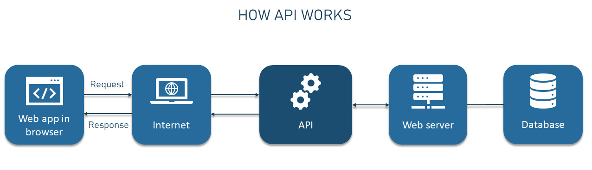

<div align="center">

[**_``Go Back``_**](../README.md)

# Advanced Android Concepts

</div>

## Local database with SQLite
------------------------------

``SQLite`` is a self-contained, serverless, and zero-configuration relational database management system. It's often used as a local database in applications where a full-fledged client-server database system like **MySQL** or **PostgreSQL** might be overkill.


Using ``SQLite`` as a local database in Android applications is a common approach for storing and managing data on the device. Android provides a built-in SQLite library and framework to make it easier to work with ``SQLite`` databases. 

### **``SQLiteOpenHelper`` and ``SQLiteDatabase``**

#### ``SQLiteOpenHelper``:

``SQLiteOpenHelper`` is a helper class that facilitates database creation and version management. It's designed to be subclassed to define the database's structure (tables, indexes, etc.) and handle any necessary migration when the database schema evolves. The primary responsibilities of ``SQLiteOpenHelper`` include:

- **Database Creation**: When an instance of ``SQLiteOpenHelper`` is constructed, it takes care of creating or opening the database. The **``onCreate()``** method is called when the database is created for the first time.

- **Database Upgrade**: When the version number of the database changes, the **``onUpgrade()``** method is called. This method is responsible for migrating data and schema changes from the old version to the new version of the database.

#### Constructor and Methods:

**Constructor:**

```Java
public SQLiteOpenHelper(Context context, String name, SQLiteDatabase.CursorFactory factory, int version)
```
Creates a new instance of ``SQLiteOpenHelper``:
- **``context``**: The context of the application.
- **``name``**: The name of the database file.
- **``factory``**: A cursor factory (set to null by default).
- **``version``**: The version number of the database.

**Methods:**

- ``onCreate(SQLiteDatabase db)``:
    
    ```Java
    public abstract void onCreate(SQLiteDatabase db)
    ```
    
    - Called when the database is created for the first time.
    - You should create tables and initialize the schema in this method.

- ``onUpgrade(SQLiteDatabase db, int oldVersion, int newVersion)``:
    ```Java
    public abstract void onUpgrade(SQLiteDatabase db, int oldVersion, int newVersion)
    ```

    - Called when the database needs to be upgraded.
    - You should handle changes to the schema or data migration in this method.

- ``onDowngrade(SQLiteDatabase db, int oldVersion, int newVersion)``:
    ```Java
    public void onDowngrade(SQLiteDatabase db, int oldVersion, int newVersion)
    ```

    - Called when the database needs to be downgraded.
    - You can implement this method to handle schema changes for downgrades.

- ``getWritableDatabase()``:
    ```Java
    public SQLiteDatabase getWritableDatabase()
    ```
    - Returns a writable database instance.
    - Use this for operations that modify data.

- ``getReadableDatabase()``:
    ```Java
    public SQLiteDatabase getReadableDatabase()
    ```
    - Returns a readable database instance.
    - Use this for read-only operations.

- ``close()``:
    ```Java
    public synchronized void close()
    ```
    - Closes the database helper.
    - Releases any resources associated with the helper.

#### ``SQLiteDatabase``:

The ``SQLiteDatabase`` class in Android is a fundamental component for managing and interacting with SQLite databases within your app. It provides methods for performing various database operations, such as executing SQL queries, inserting, updating, querying, and deleting data.

**Methods:**

- ``execSQL(String sql)``:
    ```Java
    public void execSQL(String sql)
    ```
    - Executes a single SQL statement that is not a query. 
    - Useful for executing statements like creating tables, inserting, updating, and deleting data.

    ```Java
    String createTableSQL = "CREATE TABLE contacts (id INTEGER PRIMARY KEY, name TEXT, phone TEXT)";
    db.execSQL(createTableSQL);
    ```

- ``query(String table, String[] columns, String selection, String[] selectionArgs, String groupBy, String having, String orderBy)``:

    ```Java
    public Cursor query(String table, String[] columns, String selection, String[] selectionArgs, String groupBy, String having, String orderBy)
    ```
    - Executes a SELECT query on the database.
    - Returns a Cursor object containing the query results.

    ```Java
    Cursor cursor = db.query(
        "contacts",  // table name
        null,       // columns (null means all columns)
        null,       // selection
        null,       // selectionArgs
        null,       // groupBy
        null,       // having
        null        // orderBy
    );
    while (cursor.moveToNext()) {
        String name = cursor.getString(cursor.getColumnIndex("name"));
        String phone = cursor.getString(cursor.getColumnIndex("phone"));
        // Process the data
    }
    cursor.close();
    ```

- ``insert(String table, String nullColumnHack, ContentValues values)``:
    ```Java
    public long insert(String table, String nullColumnHack, ContentValues values)
    ```
    - Inserts a new row into the specified table using the provided values.
    - Returns the row ID of the newly inserted row, or ``-1`` if an error occurred.
    
    ```Java
    ContentValues values = new ContentValues();
    values.put("name", "Alice");
    values.put("phone", "123-456-7890");
    long newRowId = db.insert("contacts", null, values);
    ```

- ``update(String table, ContentValues values, String whereClause, String[] whereArgs)``:
    ```Java
    public int update(String table, ContentValues values, String whereClause, String[] whereArgs)
    ```
    - Updates one or more rows in the specified table.
    - Returns the number of rows affected.

    ```Java
    ContentValues updatedValues = new ContentValues();
    updatedValues.put("phone", "987-654-3210");

    String whereClause = "name=?";
    String[] whereArgs = {"Alice"};

    int updatedRows = db.update("contacts", updatedValues, whereClause, whereArgs);
    ```

- ``delete(String table, String whereClause, String[] whereArgs)``:
    ```Java
    public int delete(String table, String whereClause, String[] whereArgs)
    ```
    - Deletes one or more rows from the specified table.
    - Returns the number of rows affected.

    ```Java
    String whereClause = "name=?";
    String[] whereArgs = {"Alice"};
    int deletedRows = db.delete("contacts", whereClause, whereArgs);
    ```

- ``rawQuery(String sql, String[] selectionArgs)``:
    ```Java
    public Cursor rawQuery(String sql, String[] selectionArgs)
    ```
    - Executes a raw SQL query and returns a Cursor with the query results.
    - Useful when you need to run custom SQL queries

    ```Java
    // Assume you have a reference to SQLiteDatabase named db
    String author = "J.K. Rowling";

    // Define the SQL query with placeholders for selection arguments
    String query = "SELECT * FROM books WHERE author = ?";

    // Specify the selection arguments
    String[] selectionArgs = {author};

    // Execute the raw SQL query
    Cursor cursor = db.rawQuery(query, selectionArgs);

    // Iterate through the cursor to retrieve query results
    while (cursor.moveToNext()) {
        int id = cursor.getInt(cursor.getColumnIndex("id"));
        String title = cursor.getString(cursor.getColumnIndex("title"));
        String retrievedAuthor = cursor.getString(cursor.getColumnIndex("author"));

        // Process the data
        System.out.println("Book ID: " + id);
        System.out.println("Title: " + title);
        System.out.println("Author: " + retrievedAuthor);
    }

    // Close the cursor when done
    cursor.close();
    ```

### **ContentValues**
``ContentValues`` is a class in Android that is used to store a set of **key-value** pairs. It's primarily used for inserting or updating data in databases using methods like ``insert()`` or ``update()`` in conjunction with database operations. Here's a list of key methods provided by the ``ContentValues`` class in ``Android`` :

- ``put(String key, Byte value)``
- ``put(String key, Short value)``
- ``put(String key, Integer value)``
- ``put(String key, Long value)``
- ``put(String key, Float value)``
- ``put(String key, Double value)``
- ``put(String key, String value)``
- ``put(String key, byte[] value)``
- ``putNull(String key)``
- ``getAsString(String key)``
- ``getAsInteger(String key)``
- ``getAsLong(String key)``
- ``getAsFloat(String key)``
- ``getAsDouble(String key)``
- ``getAsByteArray(String key)``
- ``containsKey(String key)``
- ``remove(String key)``
- ``size()``

### **Cursor**

In Android, a ``Cursor`` is an interface that represents the result set of a database query. It provides methods to navigate through the query results and access the data returned by the query. Cursors are commonly used to retrieve and manipulate data from databases and other data sources in Android applications.

#### Retrieving Data:

You can use various methods in the ``Cursor`` interface to retrieve data from the result set:

- ``moveToNext()``: Moves the cursor to the next row if available and returns ``true``. Returns ``false`` if there are no more rows.
- ``moveToPrevious()``: Moves the cursor to the previous row if available and returns ``true``. Returns ``false`` if there are no more rows.
- ``moveToFirst()``: Moves the cursor to the first row and returns ``true``. Returns ``false`` if the result set is empty.
- ``moveToLast()``: Moves the cursor to the last row and returns ``true``. Returns ``false`` if the result set is empty.
- ``moveToPosition(int position)``: Moves the cursor to the specified position in the result set.

#### Accessing Data:

Once the cursor is positioned on a specific row, you can use methods to access column values:

- ``getInt(int columnIndex)``, ``getLong(int columnIndex)``, ``getFloat(int columnIndex)``, ``getDouble(int columnIndex)``: Retrieve numeric values from the specified column.
- ``getString(int columnIndex)``: Retrieve string values from the specified column.
- ``getBlob(int columnIndex)``: Retrieve binary data (BLOB) from the specified column.

#### Column Indices:

Column indices in the cursor are zero-based. You can retrieve column indices using methods like:

- ``getColumnIndex(String columnName)``
- ``getColumnIndexOrThrow(String columnName)``

#### Closing the Cursor:

After you're done using the ``Cursor``, it's important to close it to release associated resources and avoid memory leaks:

- ``close()``: Closes the cursor, releasing any resources it holds.

**Example**
```Java
// Assuming 'db' is an instance of SQLiteDatabase and 'tableName' is the table name
Cursor cursor = db.query(tableName, null, null, null, null, null, null);

if (cursor.moveToFirst()) {
    do {
        int id = cursor.getInt(cursor.getColumnIndexOrThrow("id"));
        String name = cursor.getString(cursor.getColumnIndexOrThrow("name"));
        int age = cursor.getInt(cursor.getColumnIndexOrThrow("age"));

        // Process the data
        // ...
    } while (cursor.moveToNext());
}

cursor.close(); // Close the cursor when done
```

### **Eastablishing connection, Creating Table and Database, Data manipulation**

To establish a connection with an ``SQLite`` database in an Android application, you need to follow these steps:

#### Create a Database Helper Class:
Create a class that extends ``SQLiteOpenHelper``. This class will handle database creation, version management, and other operations.

```Java
public class MyDatabaseHelper extends SQLiteOpenHelper {

    private static final String DATABASE_NAME = "mydatabase.db";
    private static final int DATABASE_VERSION = 1;

    public MyDatabaseHelper(Context context) {
        super(context, DATABASE_NAME, null, DATABASE_VERSION);
    }

    @Override
    public void onCreate(SQLiteDatabase db) {
        // Create tables and initial schema here
        db.execSQL("CREATE TABLE users (id INTEGER PRIMARY KEY, username TEXT, email TEXT)");
    }

    @Override
    public void onUpgrade(SQLiteDatabase db, int oldVersion, int newVersion) {
        // Handle database upgrades when the version changes
    }
}
```
#### Create an Instance of the Database Helper:
In your activity or application code, create an instance of the ``MyDatabaseHelper`` class to manage the database connection.

```Java
MyDatabaseHelper dbHelper = new MyDatabaseHelper(this);
SQLiteDatabase db = dbHelper.getWritableDatabase(); // Open or create the database
```
#### Perform Database Operations:
Once you have the ``SQLiteDatabase`` instance, you can perform various database operations using methods like ``insert``, ``query``, ``update``, and ``delete``.

```Java
// Insert data
ContentValues values = new ContentValues();
values.put("username", "john_doe");
values.put("email", "john@example.com");
long newRowId = db.insert("users", null, values);

// Query data
String[] projection = {"id", "username", "email"};
Cursor cursor = db.query("users", projection, null, null, null, null, null);

while (cursor.moveToNext()) {
    int userId = cursor.getInt(cursor.getColumnIndexOrThrow("id"));
    String username = cursor.getString(cursor.getColumnIndexOrThrow("username"));
    String email = cursor.getString(cursor.getColumnIndexOrThrow("email"));
    // Process retrieved data
}

cursor.close();

// Update data
ContentValues updatedValues = new ContentValues();
updatedValues.put("email", "new_email@example.com");
String selection = "username = ?";
String[] selectionArgs = {"john_doe"};
int updatedRows = db.update("users", updatedValues, selection, selectionArgs);

// Delete data
String deleteSelection = "username = ?";
String[] deleteSelectionArgs = {"john_doe"};
int deletedRows = db.delete("users", deleteSelection, deleteSelectionArgs);
```

#### Closing the Database:
It's important to close the database when you're done using it to free up resources.

```Java
db.close(); 
```

### **CRUD Implementation**

**activity_main.xml**

```Xml
<?xml version="1.0" encoding="utf-8"?>
<LinearLayout
    xmlns:android="http://schemas.android.com/apk/res/android"
    android:orientation="vertical"
    android:layout_width="match_parent"
    android:layout_height="match_parent">
    <EditText
        android:layout_width="match_parent"
        android:layout_height="wrap_content"
        android:hint="Enter Sid"
        android:layout_margin="10dp"
        android:id="@+id/edtSid"
        />
    <EditText
        android:layout_width="match_parent"
        android:layout_height="wrap_content"
        android:hint="Enter Name"

        android:layout_margin="10dp"
        android:id="@+id/edtName"
        />
    <EditText
        android:layout_width="match_parent"
        android:layout_height="wrap_content"
        android:hint="Enter Address"
        android:layout_margin="10dp"
        android:id="@+id/edtAddress"
        />
    <Button
        android:layout_width="match_parent"
        android:layout_height="wrap_content"
        android:text="Insert"
        android:layout_margin="10dp"
        android:id="@+id/btnInsert"
        />
    <Button
        android:layout_width="match_parent"
        android:layout_height="wrap_content"
        android:text="Select"
        android:layout_margin="10dp"
        android:id="@+id/btnSelect"
        />
    <Button
        android:layout_width="match_parent"
        android:layout_height="wrap_content"
        android:text="Update"
        android:layout_margin="10dp"
        android:id="@+id/btnUpdate"
        />
    <Button
        android:layout_width="match_parent"
        android:layout_height="wrap_content"
        android:text="Delete"
        android:layout_margin="10dp"
        android:id="@+id/btnDelete"
        />
    <TextView
        android:layout_width="wrap_content"
        android:layout_height="wrap_content"
        android:text="Result"
        android:layout_margin="10dp"
        android:textSize="20sp"
        android:id="@+id/txtResult"
        />
</LinearLayout>
```

**DbHelper.java**

```Java
import android.app.Activity;
import android.database.Cursor;
import android.database.sqlite.SQLiteDatabase;
import android.database.sqlite.SQLiteOpenHelper;

public class DbHelper extends SQLiteOpenHelper {
    private static final String DATABASE_NAME = "mydatabase.db";
    private static final int DATABASE_VERSION = 1;
    
    public DbHelper(Activity context){
        super(context, DATABASE_NAME, null, DATABASE_VERSION);
    }


    @Override
    public void onCreate(SQLiteDatabase db) {
        String sql = "CREATE TABLE student(sid INT PRIMARY KEY, name TEXT, address TEXT)";
        db.execSQL(sql);
    }


    @Override
    public void onUpgrade(SQLiteDatabase db, int i, int i1) 
    {

    }
    
    public void sqlExec(String sql){
        SQLiteDatabase db = this.getWritableDatabase();
        db.execSQL(sql);
    }
    
    public Cursor sqlQuery(String sql){
        SQLiteDatabase db = this.getReadableDatabase();
        Cursor cursor = db.rawQuery(sql,null);
        return cursor;
    }
}
```

**MainActivity.java**

```Java
import android.app.Activity;
import android.database.Cursor;
import android.os.Bundle;
import android.widget.Button;
import android.widget.EditText;
import android.widget.TextView;
import android.widget.Toast;

public class MainActivity extends Activity {
    EditText edtSid,edtName,edtAddress;
    Button btnInsert,btnSelect,btnUpdate,btnDelete;
    TextView txtRes;
    DbHelper helper;

    @Override
    protected void onCreate(Bundle b){
        super.onCreate(b);
        setContentView(R.layout.activity_main);

        helper = new DbHelper(this);
        edtSid = findViewById(R.id.edtSid);
        edtName = findViewById(R.id.edtName);
        edtAddress = findViewById(R.id.edtAddress);
        btnInsert = findViewById(R.id.btnInsert);
        btnSelect = findViewById(R.id.btnSelect);
        txtRes = findViewById(R.id.txtResult);
        btnUpdate = findViewById(R.id.btnUpdate);
        btnDelete = findViewById(R.id.btnDelete);


        btnInsert.setOnClickListener(view -> {
            int sid = Integer.parseInt(edtSid.getText().toString());
            String name = edtName.getText().toString();
            String address = edtAddress.getText().toString();
            String sql = "INSERT INTO student(sid,name,address) VALUES('"+sid+"','"+name+"','"+address+"')";
            helper.sqlExec(sql);
            Toast.makeText(this, "Inserted Successfully!", Toast.LENGTH_SHORT).show();
        });


        btnUpdate.setOnClickListener(view -> {
            int sid = Integer.parseInt(edtSid.getText().toString());
            String name = edtName.getText().toString();
            String address = edtAddress.getText().toString();
            String sql = "UPDATE student SET name='"+name+"', address='"+address+"' WHERE sid='"+sid+"'";
            helper.sqlExec(sql);
            Toast.makeText(this, "Updated Successfully!", Toast.LENGTH_SHORT).show();
        });

        btnDelete.setOnClickListener(view -> {
            int sid = Integer.parseInt(edtSid.getText().toString());
            String sql = "DELETE FROM student WHERE sid='"+sid+"'";
            helper.sqlExec(sql);
            Toast.makeText(this, "Deleted Successfully!", Toast.LENGTH_SHORT).show();
        });


        btnSelect.setOnClickListener(view -> {
            String sql = "SELECT * FROM student";
            Cursor cursor = helper.sqlQuery(sql);
            String res = "";
            while(cursor.moveToNext()){
                int sid = cursor.getInt(0);
                String name = cursor.getString(1);
                String address = cursor.getString(2);
                res+=sid+"\t"+name+"\t"+address+"\n";
            }
            txtRes.setText(res);
        });
    }
}
```

## Introduction to API
-----------------------
An ``API``, or ``Application Programming Interface``, is a set of defined rules and protocols that allows different software applications to communicate and interact with each other. APIs enable developers to build upon existing software components, services, or platforms without needing to understand the internal complexities of those components.

**How do APIs work?**

The working principle of an ``API`` is commonly expressed through the **request-response** communication between a **client** and a **server**. The client is any front-end application that a user interacts with. The server is in charge of backend logic and database operations. In this scenario, an API works as a middle layer between the client and the server, making it possible to send data requests and responses.

<div align="center">



</div>

### **API Types**

APIs come in various types, each serving a specific purpose and catering to different scenarios. Here are some common types of APIs:

- **Web APIs (HTTP APIs)**: Web APIs, often referred to as HTTP APIs or RESTful APIs, are a common type of API used for communication over the web using standard HTTP methods. They follow the principles of Representational State Transfer (REST) and provide endpoints for clients to access resources or perform actions on remote servers. Web APIs are widely used for building web applications, mobile apps, and integrating with external services.

- **Library APIs**: Library APIs are sets of functions and classes provided by software libraries or frameworks that developers can use to perform specific tasks without having to write the code from scratch. These APIs encapsulate complex operations and provide pre-built functionalities. In Android, for example, the Android SDK provides a wide range of library APIs for various tasks such as UI components, database access, and more.

- **Operating System APIs**: Operating system APIs provide developers with access to the underlying functionalities of an operating system. They enable applications to interact with hardware, manage memory, access file systems, handle user input, and perform other system-level tasks. For instance, Android provides APIs that allow apps to utilize device features like the camera, sensors, and networking.

- **Database APIs**: Database APIs allow applications to interact with databases, perform CRUD (Create, Read, Update, Delete) operations, and manage data. In Android, developers use SQLiteOpenHelper and SQLiteDatabase classes to interact with local databases.

- **Remote APIs**: Remote APIs enable communication between applications on different machines or devices. These APIs are crucial for building distributed systems and enabling interoperability between different software components. Examples include APIs used for communication between client and server applications, often through protocols like HTTP or WebSockets.

## Introduction to JSON

``JSON (JavaScript Object Notation)`` is a lightweight data interchange format that is easy for humans to read and write, and easy for machines to parse and generate. It is widely used for representing structured data and transmitting it between a server and a client, making it a popular choice for APIs, web services, and data storage. ``JSON`` is language-independent, which means it can be used with virtually any programming language.

Key characteristics of ``JSON`` include:

- **``Simple Syntax``**: ``JSON`` uses a simple and straightforward syntax that consists of **key-value** pairs. Data is organized into objects (collections of key-value pairs) and arrays (ordered lists of values).

- **``Data Types``**: ``JSON`` supports several data types, including **strings**, **numbers**, **booleans**, **arrays**, **objects**, and ``null``. This allows you to represent a wide range of data structures.

- **``Human-Readable``**: ``JSON`` is easy for humans to read and write, making it a preferred format for configuration files, data storage, and ``API`` responses.

- **``Language-Independent``**: ``JSON`` can be used with any programming language that supports text-based data. Libraries and parsers are available for most programming languages to handle ``JSON`` data.

- **``Lightweight``**: ``JSON`` data is compact and efficient to transmit over networks, making it suitable for web applications and APIs.

- **``Hierarchical Structure``**: JSON allows nesting of objects and arrays within each other, enabling the representation of complex data structures.

Here's an example of ``JSON`` data representing information about a person:

```JSON
{
  "name": "Prashant Bhandari",
  "age": 24,
  "isStudent": true,
  "hobbies": ["Cooking", "Listening Songs", "Programming"],
  "address": {
    "city": "Birtamode",
    "district":"Jhapa",
    "country": "Nepal"
  }
}
```
In this example, the ``JSON`` object contains various data types such as **strings**, **numbers**, a **boolean**, an **array**, and a **nested object**.

## Volley
-----------
``Volley`` is an **Android library** developed by ``Google`` that simplifies network operations such as making HTTP requests and handling responses. It provides a convenient and efficient way to manage network requests and response processing. ``Volley`` is designed to be easy to use, lightweight, and optimized for performance.

Features of Volley:

- Request queuing and prioritization.
- Effective request cache and memory management.
- Extensibility and customization of the library to our needs.
- Cancelling the requests.

### **Classes and methods of Volley library:**

#### ``RequestQueue``:
The ``RequestQueue`` handles the execution of network requests. It maintains a queue of requests and manages the dispatching of these requests to the network.

Methods:
- ``RequestQueue.newRequestQueue(Context context)``: Creates a new instance of ``RequestQueue``.
- ``RequestQueue.add(Request<T> request)``: Adds a request to the queue for execution.

#### ``Request<T>``: 
The ``Request`` class represents a single network request. You can subclass it to create different types of requests like ``StringRequest``, ``JsonObjectRequest``, ``JsonArrayRequest``, etc.

Common Methods:
- ``void deliverResponse(T response)``: Delivers the parsed response to the response listener.
- ``void deliverError(VolleyError error)``: Delivers the error to the error listener.

#### ``Request.Method``:
In ``Volley``, the ``Request.Method`` class provides constants that represent different ``HTTP`` methods for making network requests. These constants help you specify the type of request you want to perform, such as **GET**, **POST**, **PUT**, **DELETE**, etc.

Here's a list of some commonly used constants in the ``Request.Method`` class:

- ``Request.Method.GET``: Represents a **GET** request. Used to retrieve data from the server.
- ``Request.Method.POST``: Represents a **POST** request. Used to send data to the server.
- ``Request.Method.PUT``: Represents a **PUT** request. Used to update existing data on the server.
- ``Request.Method.DELETE``: Represents a **DELETE** request. Used to delete data from the server.
- ``Request.Method.HEAD``: Represents a **HEAD** request. Used to retrieve headers from the server.
- ``Request.Method.OPTIONS``: Represents an **OPTIONS** request. Used to retrieve information about the communication options for the target resource.
- ``Request.Method.PATCH``: Represents a **PATCH** request. Used to apply partial modifications to a resource.

#### ``StringRequest``:

Subclass of ``Request`` that is used to send a network request and receive a string response.

Constructor:
- ``StringRequest(int method, String url, Response.Listener<String> listener, Response.ErrorListener errorListener)``: Creates a new instance of ``StringRequest``.

#### ``JsonObjectRequest``:
Subclass of ``Request`` that is used to send a network request and receive a JSON object response.

Constructor:
- ``JsonObjectRequest(int method, String url, JSONObject jsonRequest, Response.Listener<JSONObject> listener, Response.ErrorListener errorListener)``: Creates a new instance of ``JsonObjectRequest``.

#### ``JsonArrayRequest``:
Subclass of Request that is used to send a network request and receive a ``JSON`` array response.

Constructor:
- ``JsonArrayRequest(int method, String url, JSONArray jsonRequest, Response.Listener<JSONArray> listener, Response.ErrorListener errorListener)``: Creates a new instance of ``JsonArrayRequest``.

#### ``VolleyError``:
Represents an error that occurred during a network request. It includes information about the error, such as error message, status code, and network response data.

#### ``Response.Listener<T>``:
Interface for defining a callback that receives the response of a successful network request.

Method:
- ``void onResponse(T response)``: Called when the request is successful and a response is received.

#### ``Response.ErrorListener``:
Interface for defining a callback that handles errors occurring during a network request.

Method:
- ``void onErrorResponse(VolleyError error)``: Called when an error occurs during the request.

### Using Volley

#### Import Volley Library:

Open your app's ``build.gradle`` file, which is located in the app module of your Android project :

```gradle
dependencies {
    // ... other dependencies ...
    implementation 'com.android.volley:volley:1.2.0'
}
```

#### Add Internet Permission:

Open your app's ``AndroidManifest.xml`` file, which is located in the ``app/src/main`` directory.

```XML
<!-- app/src/main/AndroidManifest.xml -->
<manifest xmlns:android="http://schemas.android.com/apk/res/android"
    package="com.example.myapp">
    <!-- ... other elements ... -->
    <uses-permission android:name="android.permission.INTERNET" />
    <!-- ... other elements ... -->
</manifest>
```

Make sure to insert the ``<uses-permission>`` tag within the ``<manifest>`` element and before other elements in your manifest.

#### Using Volley in Your Code:

You can now use ``Volley`` to make network requests in your app's ``Java`` code. Here's a basic example of making a ``StringRequest`` using ``Volley``:


**Imports:**
```Java
import com.android.volley.Request;
import com.android.volley.Response;
import com.android.volley.VolleyError;
import com.android.volley.toolbox.StringRequest;
import com.android.volley.toolbox.Volley;
```

**Implementations:**
```Java
// Create a RequestQueue instance
RequestQueue requestQueue = Volley.newRequestQueue(this);

String url = "https://example.com/api/data";

// Create a StringRequest
StringRequest stringRequest = new StringRequest(Request.Method.GET, url,
        new Response.Listener<String>() {
            @Override
            public void onResponse(String response) {
                // Process the response
            }
        }, new Response.ErrorListener() {
            @Override
            public void onErrorResponse(VolleyError error) {
                // Handle errors
            }
        });

// Add the request to the RequestQueue
requestQueue.add(stringRequest);
```

### **Retrieving content from remote server:**

**activity_main.xml**
```XML
<?xml version="1.0" encoding="utf-8"?>
<RelativeLayout xmlns:android="http://schemas.android.com/apk/res/android"
    xmlns:tools="http://schemas.android.com/tools"
    android:layout_width="match_parent"
    android:layout_height="match_parent"
    tools:context=".MainActivity">
    <TextView
        android:id="@+id/contentTextView"
        android:layout_width="match_parent"
        android:layout_height="wrap_content"
        android:text="Content will be displayed here"
        android:padding="16dp" />
</RelativeLayout>
```

**MainActivity.java:**
```Java
import android.app.Activity;
import android.os.Bundle;
import android.widget.TextView;
import android.widget.Toast;
import com.android.volley.Request;
import com.android.volley.RequestQueue;
import com.android.volley.Response;
import com.android.volley.VolleyError;
import com.android.volley.toolbox.StringRequest;
import com.android.volley.toolbox.Volley;

public class MainActivity extends Activity {

    private TextView contentTextView;

    @Override
    protected void onCreate(Bundle savedInstanceState) {
        super.onCreate(savedInstanceState);
        setContentView(R.layout.activity_main);
        contentTextView = findViewById(R.id.contentTextView);
        fetchContent();
    }

    private void fetchContent() {
        RequestQueue queue = Volley.newRequestQueue(this);
        String url = "https://example.com/api/data";
        StringRequest stringRequest = new StringRequest(Request.Method.GET, url,
            new Response.Listener<String>() {
                @Override
                public void onResponse(String response) {
                    contentTextView.setText(response);
                }
            }, new Response.ErrorListener() {
                @Override
                public void onErrorResponse(VolleyError error) {
                    Toast.makeText(MainActivity.this, "Error", Toast.LENGTH_SHORT).show();
                }
            });
        queue.add(stringRequest);
    }
}
```
### **Sending content to remote server**

**activity_main.xml**
```XML
<?xml version="1.0" encoding="utf-8"?>
<RelativeLayout xmlns:android="http://schemas.android.com/apk/res/android"
    xmlns:tools="http://schemas.android.com/tools"
    android:layout_width="match_parent"
    android:layout_height="match_parent"
    android:padding="16dp"
    tools:context=".MainActivity">
    <EditText
        android:id="@+id/nameEditText"
        android:layout_width="match_parent"
        android:layout_height="wrap_content"
        android:hint="Enter Name"
        android:layout_marginBottom="8dp"/>
    <EditText
        android:id="@+id/rollNoEditText"
        android:layout_width="match_parent"
        android:layout_height="wrap_content"
        android:layout_below="@id/nameEditText"
        android:hint="Enter Roll No"
        android:layout_marginBottom="16dp"/>
    <Button
        android:id="@+id/sendButton"
        android:layout_width="wrap_content"
        android:layout_height="wrap_content"
        android:layout_centerHorizontal="true"
        android:layout_below="@id/rollNoEditText"
        android:text="Send Data"/>
</RelativeLayout>
```

**MainActivity.java**
```Java
import android.app.Activity;
import android.os.Bundle;
import android.widget.Button;
import android.widget.EditText;
import android.widget.Toast;
import com.android.volley.Request;
import com.android.volley.RequestQueue;
import com.android.volley.Response;
import com.android.volley.VolleyError;
import com.android.volley.toolbox.StringRequest;
import com.android.volley.toolbox.Volley;

public class MainActivity extends Activity {

    private EditText nameEditText;
    private EditText rollNoEditText;
    private Button sendButton;

    @Override
    protected void onCreate(Bundle savedInstanceState) {
        super.onCreate(savedInstanceState);
        setContentView(R.layout.activity_main);
        nameEditText = findViewById(R.id.nameEditText);
        rollNoEditText = findViewById(R.id.rollNoEditText);
        sendButton = findViewById(R.id.sendButton);
        sendButton.setOnClickListener(v -> sendStudentInfo());
    }

    private void sendStudentInfo() {
        String name = nameEditText.getText().toString();
        String rollNo = rollNoEditText.getText().toString();
        RequestQueue queue = Volley.newRequestQueue(this);
        String url = "https://example.com/api/send";
        StringRequest stringRequest = new StringRequest(Request.Method.POST, url,
            new Response.Listener<String>() {
                @Override
                public void onResponse(String response) {
                    Toast.makeText(MainActivity.this, "Info sent successfully", Toast.LENGTH_SHORT).show();
                }
            }, new Response.ErrorListener() {
            @Override
            public void onErrorResponse(VolleyError error) {
                Toast.makeText(MainActivity.this, "Error sending content", Toast.LENGTH_SHORT).show();
            }}) {
            // Override this method to set the request body (data to send)
            @Override
            public byte[] getBody() {
                String postData = "Name: " + name + "\nRoll No: " + rollNo;
                return postData.getBytes();
            }
        };
        queue.add(stringRequest);
    }
}
```

### **Implementing Google Maps in Android Application**

#### Get the Google Maps API Key:
You'll need a Google Maps API key to use Google Maps services in your Android app

#### Add Google Play services dependency:
Open your app-level ``build.gradle`` file and add the following dependency for Google Play services if it's not already there:

```Gradle
implementation 'com.google.android.gms:play-services-maps:18.0.1'
```
#### Add permissions to the AndroidManifest.xml file:
Ensure that your ``AndroidManifest.xml`` file includes the necessary permissions and the API key:

```Xml
<uses-permission android:name="android.permission.INTERNET" />
<uses-permission android:name="android.permission.ACCESS_FINE_LOCATION" />

<application>
    <!-- Add your API key here -->
    <meta-data
        android:name="com.google.android.geo.API_KEY"
        android:value="YOUR_API_KEY_HERE" />
</application>
```
#### Create a layout for the map activity:
Create an XML layout file for your map activity. For example, you can create a file named ``activity_maps.xml``:

```Xml
<?xml version="1.0" encoding="utf-8"?>
<fragment
    xmlns:android="http://schemas.android.com/apk/res/android"
    xmlns:map="http://schemas.android.com/apk/res-auto"
    xmlns:tools="http://schemas.android.com/tools"
    android:id="@+id/map"
    android:name="com.google.android.gms.maps.SupportMapFragment"
    android:layout_width="match_parent"
    android:layout_height="match_parent"
    tools:context=".MapsActivity" />
```

#### Create a MapsActivity class:
Create a new Java class for your map activity. In this class, you'll set up the map and display the location of **Kathmandu**. For example, you can create a file named ``MapsActivity.java``:

```Java
import androidx.appcompat.app.AppCompatActivity;
import android.os.Bundle;
import com.google.android.gms.maps.CameraUpdateFactory;
import com.google.android.gms.maps.GoogleMap;
import com.google.android.gms.maps.OnMapReadyCallback;
import com.google.android.gms.maps.SupportMapFragment;
import com.google.android.gms.maps.model.LatLng;
import com.google.android.gms.maps.model.MarkerOptions;

public class MapsActivity extends AppCompatActivity implements OnMapReadyCallback {
    private GoogleMap mMap;

    @Override
    protected void onCreate(Bundle savedInstanceState) {
        super.onCreate(savedInstanceState);
        setContentView(R.layout.activity_maps);

        // Obtain the SupportMapFragment and get notified when the map is ready to be used.
        SupportMapFragment mapFragment = (SupportMapFragment) getSupportFragmentManager()
                .findFragmentById(R.id.map);
        mapFragment.getMapAsync(this);
    }

    @Override
    public void onMapReady(GoogleMap googleMap) {
        mMap = googleMap;
        // Add a marker for Kathmandu and move the camera
        LatLng kathmandu = new LatLng(27.7172, 85.3240); // Kathmandu's coordinates
        mMap.addMarker(new MarkerOptions().position(kathmandu).title("Kathmandu"));
        mMap.moveCamera(CameraUpdateFactory.newLatLngZoom(kathmandu, 12.0f)); // Zoom level: 12
    }
}
```

## Procedure for Publishing Application in Google Play Store
------------------------------------------------------------

Publishing an Android application on the Google Play Store involves several steps to ensure that your app is properly prepared, tested, and presented to users. Here's a general procedure for publishing your application:

- **Create a Developer Account**:
    
    If you don't have one already, create a Google Play Developer account. There is a one-time registration fee.

- **Prepare Your App**:
    - Ensure your app is fully functional and free of major bugs.
    - Optimize your app for various device sizes and orientations.
    - Adhere to Google Play policies and guidelines.

- **Generate Signed APK**: 

    Create a signed APK of your app. A signed APK is required for distribution and ensures that your app is authentic.

- **Prepare App Assets**:
    - Design your app's icon and feature graphics according to the Google Play Store's image guidelines.
    - Write an attractive and informative app description.
    - Prepare screenshots and promotional images that showcase your app's features.

- **Create a Store Listing**:
    - Log in to your Google Play Developer Console.
    - Create a new application listing by providing app details, including title, description, screenshots, and more.
    - Set up the app's categorization, content rating, and target audience.

- **Upload APK and Set Pricing**:
    - Upload the signed APK you generated in Step 3.
    - Set the app's pricing and distribution options. You can choose to offer the app for free, charge for it, or use in-app purchases.